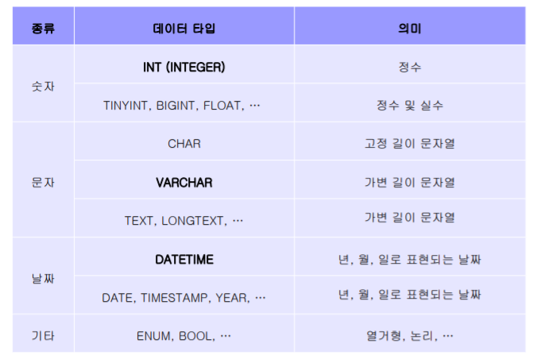

## 테이블 정의어(DDL)

1. 데이터 베이스 생성: CREATE DATABASE MYDB;
2. 테이블 생성: CREATE TABLE

```mysql
CREATE TABLE 테이블명 (
 속성명 데이터타입 [NOT NULL] [DEFAULT 기본값]
 [PRIMARY KEY (속성 리스트)]
 [UNIQUE (속성 리스트)]
 [FOREIGN KEY (속성 리스트) REFERENCES 테이블명 (속성 리스트)]
 [ON DELETE 옵션] [ON UPDATE 옵션]
);
```

- primary key: 기본키
- unique :  중복되지 않는 키
- foreign key : 외래키. 다른 테이블의 기본키

#### 자주 사용되는 속성의 데이터 타입



> 외래키 사용

```sql
CREATE TABLE 테이블명 (
 속성명 데이터타입 [NOT NULL] [DEFAULT 기본값]
 [PRIMARY KEY (속성 리스트)]
 [UNIQUE (속성 리스트)]
 [CONSTRAINT 제약조건명]
 [FOREIGN KEY (속성 리스트) REFERENCES 테이블명 (속성 리스트)]
 [ON DELETE 옵션] [ON UPDATE 옵션]
);
```

- constraint: 테이블의 관계 설정할 때 제약조건 이름. 지정하지 않으면 자동으로 생성
- foreign key: 외래키 지정(constraint 제약조건명 지정 가능)
- references: 참조하는 테이블과 속성을 지정
- on delete: 기본키가 삭제되었을 때 처리방법.  설정 안하면 나중에 기본키 삭제 불가
- on update: 기본키 수정시 처리될 방법


2. 테이블 제거 : DROP TABLE

```mariadb
DROP TABLE 테이블명;
```


3. 테이블 변경 : ALTER TABLE

> 속성추가

```sql
ALTER TABLE 테이블명
 ADD 속성명 데이터타입 [NOT NULL] [DEFAULT 기본값];

```

> 외래키(제약조건)추가

```SQL
ALTER TABLE 테이블명
ADD
[CONSTRAINT 제약조건명]
FOREIGN KEY(속성명) REFERENCES 참조테이블명(참조속성명);

## example
# 컬럼을 만든 후 외래키 관계설정하는것을 잊지 말자
# practice1테이블에서 email 가져와서 email_addr 컬럼으로 만들기
ALTER TABLE practice
	ADD email_addr VARCHAR(20);	
ALTER TABLE practice
	ADD FOREIGN KEY (email_addr)
	REFERENCES practice1(email);
```

> 속성 삭제 및 외래키(제약조건 삭제)

```SQL
ALTER TABLE 테이블명
 DROP 속성명 [CASCADE | RESTRICT];
 
ALTER TABLE 테이블명
 DROP FOREIGN KEY 제약조건명
 
```


> 제약조건 확인

```SQL
SELECT *
FROM INFORMATION_SCHEMA.TABLE_CONSTRAINTS
WHERE TABLE_NAME = 테이블명;


## 제약조건 명칭 조회
SELECT * FROM TABLE_CONSTRAINTS;

## 제약조건 삭제
##제약조건 입력
```

- 제약조건은 변경이 안된다
- 따라서 제약조건 삭제 후 다시 생성해야한다
- 제약조건은 information에 TABLE_CONSTRAINTS에 있다


#### 연습문제

>  사원 테이블의 DEPTNO 컬럼에 지정되어 있는 제약조건(CASCADE)을 삭제 후 기본키가 삭제되면 NULL 값이 입력되도록 하는 제약조건 추가 (제약조건명 FK_EMP_DEPT)

```SQL
#제약조건명  확인
SELECT * FROM information_schema.TABLE_CONSTRAINTS;

# 제약조건 삭제 및 재생성
ALTER TABLE EMP
	DROP foreign key emp_ibfk_1;
	
ALTER TABLE EMP
	ADD CONSTRAINT FK_EMP_DEPT
	FOREIGN KEY (DEPTNO) REFERENCES DEPT(DEPTNO)
	ON DELETE CASCADE;

```

- CASCADE : 기본키가 삭제되었을 때 외래키도 따라가겠다
  - 비슷하게 update cascade 옵션이 있는데, 이는 기본키에 변화가 있을때 그와 연결된 외래키들 다 똑같이 적용되는 옵션
- SET NULL : 기본키가 삭제되었을때 null 값으로 보여줌
- on delete :를 설정하지 않으면 기본키 삭제 불가능
- restrict , no action: 기본키 삭제시 아무 조치를 취하지 않음