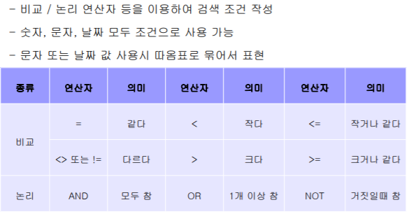
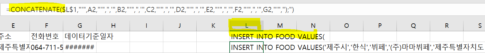

※일반적으로 테이블이름, 컬럼명, 변수 등 이름은 영어로 하는것이 일반적이나, 이해를 돕기위해 일부는 한글로 작성

## 데이터 삽입: Insert

```mySQL
INSERT INTO 테이블명
 [(속성 리스트)]
 VALUES
 (속성의 값 리스트);
 
 ### examples
INSERT INTO 부서 (부서번호, 부서이름) VALUES (1,'인사부');
INSERT INTO 부서 (부서번호, 부서이름) VALUES (2,'연구부');
INSERT INTO 부서 VALUES (3,'홍보부');

```

- 괄호 안에 컬럼을 정확히 명시해주지 않을때에는, 순서대로 값이 들어간다
- primary key로 설정해준 경우 중복된 key값은 들어갈 수 없다(오류 발생)
- 데이터를 일부만 작성해서 insert 하는 경우 Null이 생긴다

<br><br>


## 데이터 검색: SELECT

```mariadb
### 데이터 호출: select
SELECT 고객아이디, 고객이름, 등급
FROM 고객;

select * 
from 고객;
```

> 속성값  보기

```mariadb
DESC 고객;
```

<br>

> 중복없이 검색 : DISTINCT

```mysql
    SELECT DISTINCT(제조업체)
    FROM 제품;
```

> 속성명 변경 출력 : AS

```mysql
SELECT 속성명 [AS] 변경속성
FROM 테이블

## example
SELECT 제품명, 단가 AS '가격'
FROM 제품;

## 산술식 사용 가능
SELECT 제품명, 단가+500 AS '조정단가'
FROM 제품;
```

> 조건에 해당하는 데이터 검색: WHERE

```mysql
SELECT [DISTINCT] 속성 리스트
FROM 테이블 리스트
[WHERE 조건];

### example
SELECT 제품명, 재고량, 단가 
FROM 제품
WHERE 제조업체='한빛제과';

SELECT 주문제품, 수량, 주문일자
FROM 주문
WHERE 수량>=30 AND 주문일자>= '2013-03-20';
```




> 소수점

```mysql
##소수점 자르기
select truncate(2.62,0) as result from dual;

### 반올림
select round(2.62, 자리수) as result from dual;

### example
SELECT sal, round(sal*1.1,0) AS 'increased sal', sal*12 + ifnull(comm,0) AS annual
FROM emp;
```

<br>

> csv 파일 불러오기

1. heidi SQL에서 csv 파일 넣기

   - table을 미리 만들어야 한다는 것을 잊지 말자
   - 

2.  엑셀에서 미리 insert into문을 먼저 만들고 query 로 삽입

   - concatenate 함수 사용

   - 

<br>

> 부분적으로 일치하는 데이터 검색: LIKE

```mariadb
SELECT 속성 리스트
FROM 테이블
WHERE 속성명 LIKE '검색 데이터';

## examples
SELECT * FROM 고객
WHERE 직업 LIKE '___' AND 고객아이디 LIKE '%a%';
```

- 

  

> null 데이터 검색:  IS NULL / IS NOT NULL

```mariadb
SELECT 속성 리스트
FROM 테이블
WHERE 속성명 IS NULL;

## examples
SELECT * FROM emp
WHERE (comm is NOT NULL) AND (hiredate LIKE '1981-02-%');

SELECT * FROM emp
WHERE (comm is NOT NULL) AND (hiredate >= '1981-02');
```


> 데이터 정렬: order by

```mariadb
SELECT [DISTINCT] 속성 리스트
FROM 테이블
[WHERE 조건]
[ORDER BY 속성 리스트 [ASC | DESC]];

### examples
SELECT * FROM emp
ORDER BY deptno DESC, 
ename ASC;
```

> 개수 제한 :limit

```mariadb
SELECT * FROM emp
LIMIT 0,5; -- index 0번부터 5개
```

> 한 페이지마다 5건씩 있다고 했을 때 자동으로 Limit의 두가지 숫자 구하기

```python
now_page = 10 #10페이지의 게시글 번호 구하기
show_cnt = 5

end = now_page * show_cnt
start = end - show_cnt
print(start, end)
```

>30번 부서에 근무하는 사람들을 급여가 높은 순으로 정렬하여 5건씩 출력

```mysql
SELECT * FROM emp 
WHERE deptno = 30
ORDER BY sal DESC
LIMIT 0,5;
```
