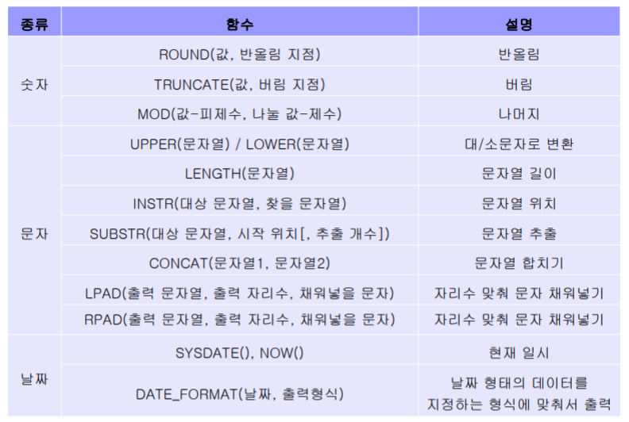
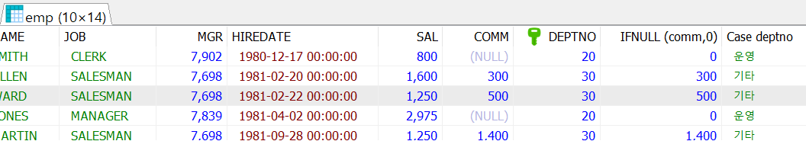
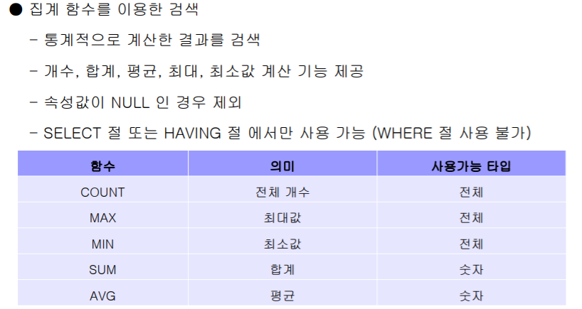
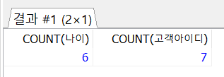

## 함수



- examples

```mysql
# 반올림
SELECT sal*0.8, ROUND(sal*0.8,0) FROM emp;

# 문자열 추출
SELECT SUBSTR(hiredate, 1, 10) FROM emp;

# 문자열 합치기
## 파이썬 등 다른 프로그램을 통해 쿼리가 들어올경우 %A%가 안될수도있다. ## 이럴 때 concat 사용 유용
SELECT * FROM emp 
WHERE ename LIKE CONCAT('%','A','%');

# 원하는 형식으로 현재 날짜 및 시간 표시
SELECT DATE_FORMAT(NOW(), '%y/%m/%d %H:%i:%s');


```

<br><br>

## 조건문

> CASE WHEN THEN ELSE END

```mariadb
SELECT *,
	IFNULL (comm,0), 
	Case deptno 
		when 10 then '총무'
		when 20 then '운영'
		ELSE '기타'
		end
 FROM emp;
```



<br>

## 집계함수




```mariadb
# max함수 
SELECT * FROM 제품;

SELECT MAX(재고량) FROM  제품; 

### 만약 재고량 max 인 제품이름을 알고싶을때는 서브쿼리 이용
SELECT * 
FROM 제품
WHERE 재고량 = (SELECT MAX(재고량)
						FROM 제품);

# 서브쿼리 사용 예시
select ename, sal 
FROM emp
WHERE sal = (SELECT max(sal) FROM emp
		WHERE deptno = 30);
						
# null값 때문에 나이 이용한 count 잘못됨						
SELECT COUNT(나이), COUNT(고객아이디) FROM 고객;

#따라서 다음과 같이
SELECT COUNT(*)FROM 고객;
SELECT COUNT(1)FROM 고객; # 메모리 축소 위해

#distinct
```



<br><br>

## 그룹별 검색 : GROUP BY, HAVING

```mysql
SELECT 제조업체, count(제조업체)FROM 제품
GROUP BY 제조업체;

## example
SELECT 등급, round(AVG(적립금),0) AS 평균적립금, COUNT(*)
 FROM 고객
 GROUP BY 등급
 HAVING AVG(적립금)>=1000
 ORDER BY 평균적립금 asc;
 
 ## example
 
SELECT WEEK, count(die)
FROM accident
GROUP BY WEEK
ORDER BY count(die) ASC
LIMIT 0,1;
```


#### 한글깨짐 해결

> 확인 (문자 형태)

```
SHOW VARIABLES LIKE 'c%';
```


> 쿼리 내에서 해결하기

```mariadb
SELECT * FROM noodle;
 SELECT company, 
 	convert(concat(COUNT(*),'개') USING UTF8) AS "COUNT",
 	CAST(concat(COUNT(*),'개') AS VARCHAR(20)) AS "CNT"
 FROM noodle
 group by company;
```


> 환경파일 수정
>
> > C:\ProgramData\Microsoft\Windows\Start Menu\Programs\MariaDB 10.4 (x64)\my.ini

```
[mysqld]
datadir=C:/Program Files/MariaDB 10.4/data
port=3306
innodb_buffer_pool_size=1515M
character-set-server=utf8
[client]
port=3306
plugin-dir=C:/Program Files/MariaDB 10.4/lib/plugin
default-character-set = utf8
```


### 자동으로 PRIMARY KEY값 정하기

> AUTO_INCREMENT

```mysql
ALTER TABLE `ACCIDENT`
	ADD CONSTRAINT `PK_ACCIDENT` -- 교통사고사망자 기본키
		PRIMARY KEY (
			`ID` -- 아이디
		);

ALTER TABLE `ACCIDENT`
	MODIFY COLUMN `ID` INT NOT NULL AUTO_INCREMENT COMMENT '아이디';
```


