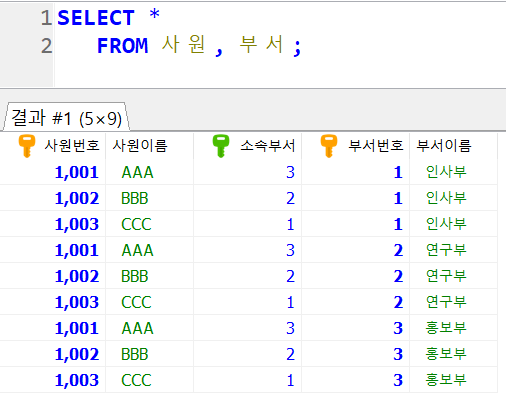

## Join

- 여러개의 테이블을 연결하여 하나의 테이블처럼 사용하는 것 
- 일반적으로 외래키가 조인 속성으로 사용 (연결하는 키의 도메인이 같아야 하기 때문)

- JOIN을 사용하지 않는 경우 (첫번째 테이블 데이터) *(두번째 테이블 데이터) 만큼 데이터가 생겨서 출력

※사원, 부서 테이블은 각각 3개의 데이터가 있음



- Where 이용한 연결


- JOIN 이용 (기능이 더 많음. 이후 where 조건 사용 가능, Outer Join 가능)


```mysql
## 'banana' 고객이 주문한 제품 정보
SELECT *
FROM 주문
JOIN 제품
ON 주문.`주문제품` = 제품.`제품번호`
WHERE 주문.`주문고객` = 'banana';
```

<br>

※테이블이 많아졌을 경우: ALIAS 사용

```mariadb
#'고명석' 고객이 주문한 제품의 제품명 검색
SELECT p.`제품명`
FROM 고객 c
JOIN 주문 O
ON c.`고객아이디` = O.`주문고객`
JOIN 제품 p
ON O.`주문제품` = p.`제품번호`
WHERE c.`고객이름` = '고명석';

```


※ 조건이 필요할경우 where 사용

```mysql
SELECT SUM(sal), dname, loc
FROM emp
JOIN dept
ON emp.DEPTNO = dept.DEPTNO
#GROUP BY 하기 전 조건에 따라 거를 수 있는 상태여서 먼저 where
where dept.loc = 'NEW YORK' OR dept.LOC = 'DALLAS' 
GROUP BY emp.DEPTNO;
```

<br><br>

## JOIN 의 종류

1. equi 조인

```
SELECT *
FROM emp
JOIN dept
ON emp.DEPTNO = dept.DEPTNO;

```

2.  Non-Equi 조인 : 컬럼 값이 일치하지 않을 때 (<, >, BETWEEN 등 사용)

```mysql
SELECT 속성 리스트
FROM 테이블1, 테이블2
WHERE 테이블1.속성 BETWEEN 테이블2.속성1 AND 테이블2.속성2
```


3.  Self 조인 : Equi 조인과 같으나 하나의 테이블만 사용해서 조인

```mysql
# 부하직원과 매니저 이름 
SELECT e1.ENAME AS empname, e2.ENAME AS mgrname
 FROM emp e1
 JOIN emp e2
 ON e1.MGR = e2.EMPNO;
```

4. Outer JOIN (합집합)
   - 연결되는 컬럼 값이 없더라도 데이터를 검색 (Null값으로 들어감)
   - Left Outer 조인과 Right Outer 조인으로 구분 

```Mysql
# 전체 제품에서 주문 내역 검색. 제품 테이블에 더 많은 정보가 있다
SELECT *
 FROM 제품 P
 left JOIN 주문 O
 ON P.`제품번호` = O.`주문제품`;
```

5. Inner JOIN (교집합)

```mysql
# 전체 제품에서 주문 내역 검색. 제품 테이블에 더 많은 정보가 있다
SELECT *
 FROM 제품 P
 JOIN 주문 O
 ON P.`제품번호` = O.`주문제품`;
```


### 기타

> IN
>
> > IN은 여러개의 조건을 만족하는 데이터를 조회하고 싶을때 사용합니다

```mysql
# name이 peter와 alice 조회
sql> SELECT *
        FROM user1
        WHERE name IN ("peter", "alice")

Copyright 
```

<br>

> IF
>
> > IF(조건, 참, 거짓)

```mysql
# 도시의 인구가 100만이 넘으면 "big city" 그렇지 않으면 "small city"를 출력하는 city_scale 컬럼을 추가
SELECT name, population, IF(population > 1000000, "big city", "small city") AS city_scale
FROM city

```

> IFNULL
>
> > IFNULL(참, 거짓)

```mysql
# 독립년도가 없는 데이터는 0으로 출력
SELECT IndepYear, IFNULL(IndepYear, 0) as IndepYear
FROM country
```

<br>

> UNION

- UNION은 SELECT 문의 결과 데이터를 하나로 합쳐서 출력합니다. 컬럼의 갯수와 타입, 순서가 같아야 합니다.
- UNION은 자동으로 distinct를 하여 중복을 제거해 줍니다. 중복제거를 안하고 컬럼 데이터를 합치고 싶으면 UNION ALL을 사용합니다. 
- 또한 UNION을 이용하면 Full Outer Join을 구현할수 있습니다.

```mysql
# user 테이블의 name 컬럼과 addr 테이블의 addr 컬럼의 데이터를 하나로 함쳐서 출력
SELECT name
FROM user
UNION
SELECT addr
FROM addr
```

> UNION ALL

```mysql
# 중복데이터를 제거하지 않고 결과 데이터 합쳐서 출력
SELECT name
FROM user
UNION ALL
SELECT addr
FROM addr
```

```mysql
# union을 이용하여 full outer join 구현
SELECT id, user.name, addr.addr
FROM user 
LEFT JOIN addr
ON user.user_id = addr.user_id
UNION
SELECT id, user.name, addr.addr
FROM user 
RIGHT JOIN addr
ON user.user_id = addr.user_id
```


<br><br>

## sub-query

- 부속 질의문(서브쿼리)을 이용한 검색
- 부속 질의문은 SELECT / FROM / WHERE 절 등 어디든 사용 가능

```mysql
SELECT 속성 리스트
FROM 테이블
WHERE 테이블.컬럼 = (SELECT 속성
 					FROM 테이블
 					WHERE 테이블.컬럼 = 값);
 					
## example; 여러개 행 sub-query 는 in을 쓴다
SELECT * 
 FROM emp
 WHERE sal in (
 		SELECT sal
		 FROM emp
		 WHERE sal = 1250
 				);
```


<br>

<br>

<br>

## UPDATE / DELETE

```mysql
UPDATE 테이블 SET

DELETE FROM 테이블

## example
DELETE FROM 주문
WHERE 주문고객 = (SELECT 고객아이디
 FROM 고객
 WHERE 등급 = 'silver'
 AND 직업 = '회사원');
```

```mysql
SELECT * FROM 제품;

## 이름이 쿵떡파이인것만 통큰파이로 바꿔줌! WHERE 필수!
UPDATE 제품 set 제품명 = '통큰파이'
 WHERE 제품명 = '쿵떡파이';
```

<br>

※  DB 접속 툴 HeidiSQL 사용 시 Auto Commit 비활성화 

```SET @@AUTOCOMMit = 0;```

```mysql
# 다시 취소하기(돌아가기)
ROLLBACK;
# 저장하기(수정본 확정)
COMMIT;
```

