## 설계과정

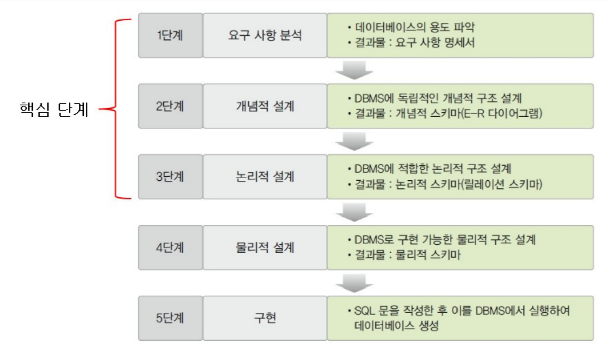

### 2단계 : 개념적 설계

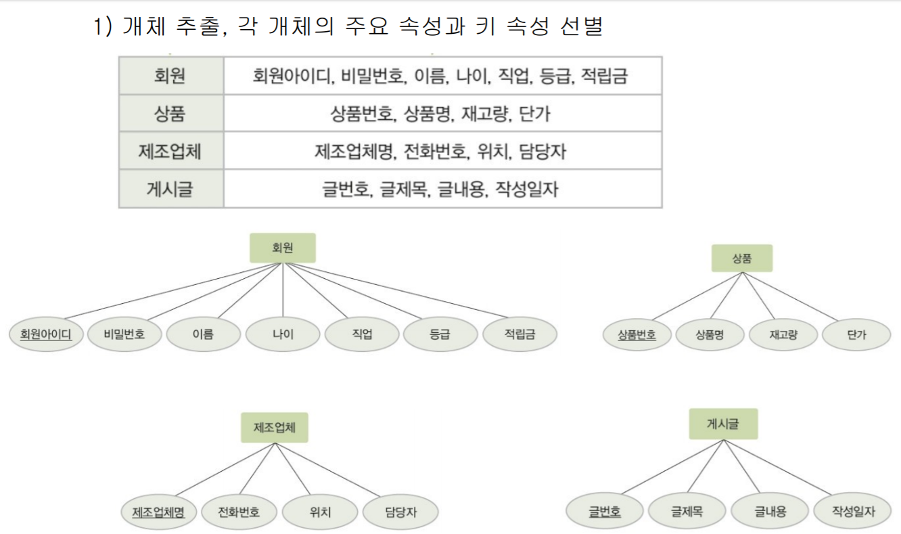

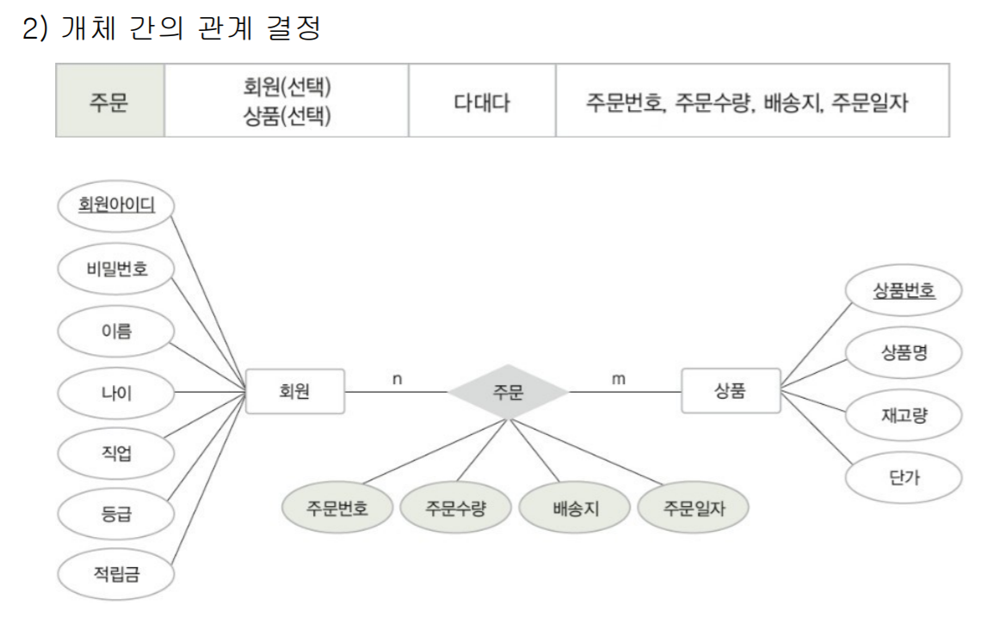

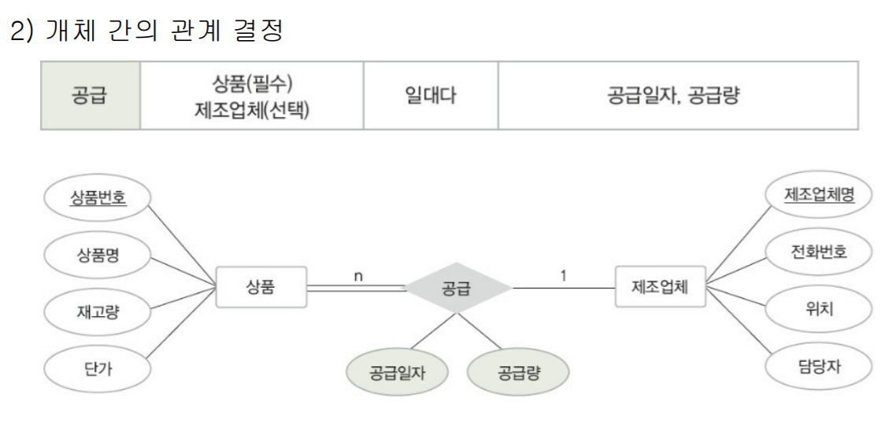


### 3단계: 논리적 설계

- 모든 개체는 릴레이션으로 변환
- 릴레이션 스키마

- 다대다(N:N) 관계인 경우 새로운 테이블(릴레이션)을 만들어야 한다
  - 각각의 기본키를 새로운 테이블의 외래키로 가져온다
  - 새로운  테이블의 기본키 설정
    - 경우 1) 복합키: (외래키1, 외래키2) 조합
    - 경우 2) 단일키 : '주문번호' 처럼 새로운 기본키 생성

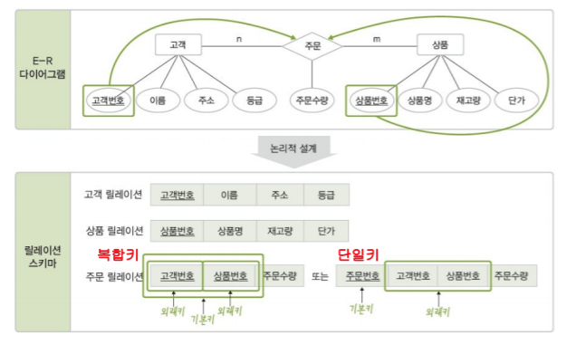

- 1:1 또는 1:N 관계인 경우
  - 1에 해당하는 테이블의 기본키를 나머지 테이블(데이터가 더 많은 테이블)의 외래키로 넣어준다.

<br><br>

### exerd 다운로드

- eclipse 또는 spring
- help 메뉴로 이동
- Install New Software 클릭
- Work with에 주소 붙여넣기 http://exerd.com/update/3.x/
- 엔터
- contact all update 체크 해제

> 새 프로젝트 만들기

- the others -> exerd files
- 대상 DBMS: MySQL
- 프로젝트 이름 및 파일이름 생성

<br>

<br>

### 연습문제

문제1)
```
1. 학원에 학생으로 등록하려면 전화번호, 이름, 학력을 입력해야 한다.

2. 학생은 전화번호로 식별한다.

3. 교육과정은 과정번호, 과정명, 정원수, 교육기간을 유지해야 한다.

4. 교육과정은 과정번호로 식별한다.

5. 학생은 하나의 교육과정에 등록 되어야 한다.

6. 강사는 강사번호, 이름, 경력을 유지해야 한다.

7. 하나의 교육과정에는 여러명의 강사가 등록 될 수 있다.
```

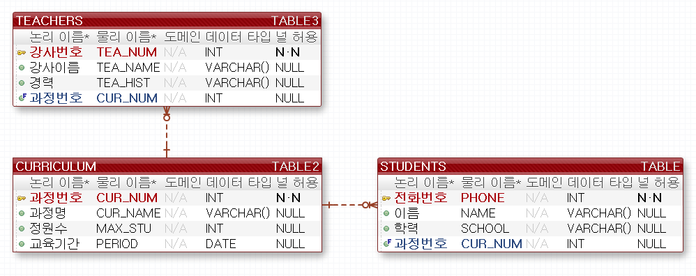

<br>

<br>
문제2)

```
1. 맛 괜찮은 부산에 회원으로 가입하려면 회원아이디, 비밀번호, 이름을 
    입력해야 한다.

2. 회원은 회원아이디로 식별한다.

3. 매장에 대한 매장번호, 매장명, 주소, 주차정보, 휴무일자, 전화번호를 
    유지해야 한다.

4. 매장은 매장번호로 식별한다.

5. 회원은 여러 매장에 좋아요 / 싫어요 의사를 표시 할 수 있고, 
    하나의 매장에 대해 여러 회원이 의사 표시를 할 수 있다.

6. 회원이 의사 표시를 하면 의사 표시에 대한 번호, 좋다 싫다 여부, 
    일자 정보를 유지해야 한다.

7. 각 매장은 여러가지 메뉴에 대한 정보를 가진다.

8. 각 매장에 대한 메뉴는 메뉴번호, 매장번호, 메뉴명, 가격 정보를 유지해야 한다.

9. 메뉴는 메뉴번호로 식별한다.
```

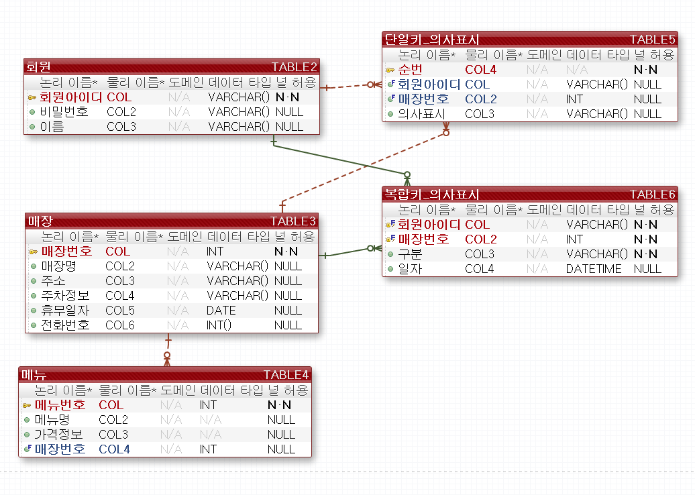

※ `단일키_의사표시` /`복합키_의사표시` 중에서 택 1

- 하지만 단일키를 권장한다
- 실선은 외래키이면서 기본키로 설정한다
- 다대다 인 경우 이런식으로 테이블을 만들어서 단일키/복합기 형식 채택


<br>

심화) 다음의 조건이 추가됨

```
1. 배달원에 대한 정보는 배달원 이름, 시급, 보유차량이 있다.
2. 배달원은 배달원번호로 식별한다
3. 하나의 매장은 여러 배달원과 계약할 수 있다.
4. 배달원은 여러 매장과 계약할 수 있다.
```

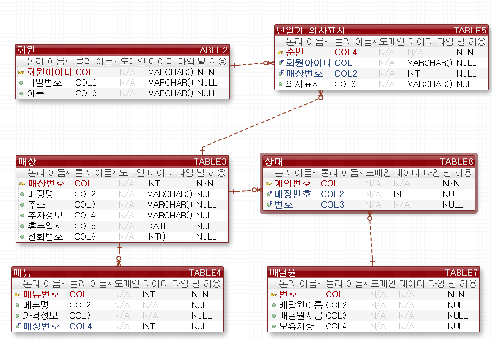


### 정규화: 중복 데이터 테이블 분리

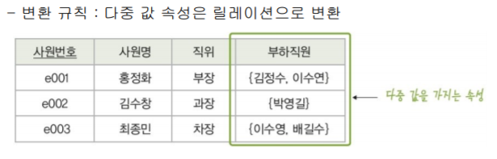

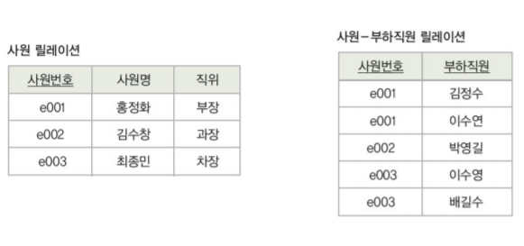

> 다대다 인 경우 사원 - 부하직원 릴레이션처럼 새로운 테이블 만들어서 구분
>
> 이처럼 중복 데이터를 최소화 하자

<br>


### 예제

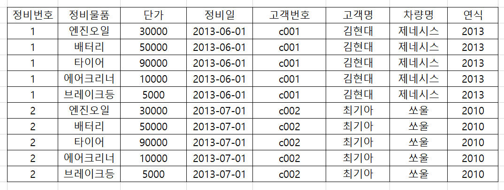

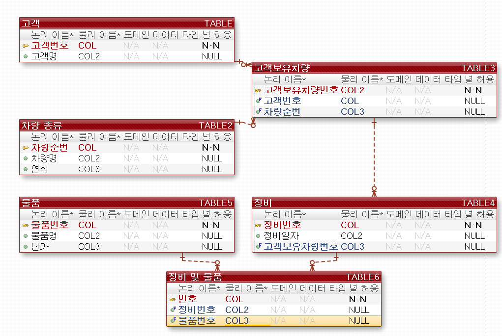

<br><br>

### 포워드 엔지니어링

> eXERD -> DB

-  [MySQL Connector/J](https://mvnrepository.com/artifact/mysql/mysql-connector-java)

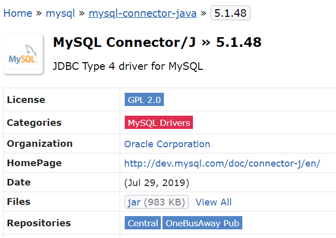

- 다운로드 해서 프로젝트와 동일 폴더에 넣기
- Window - Preferences 들어가서 다음과 같이 새 연결 만들기

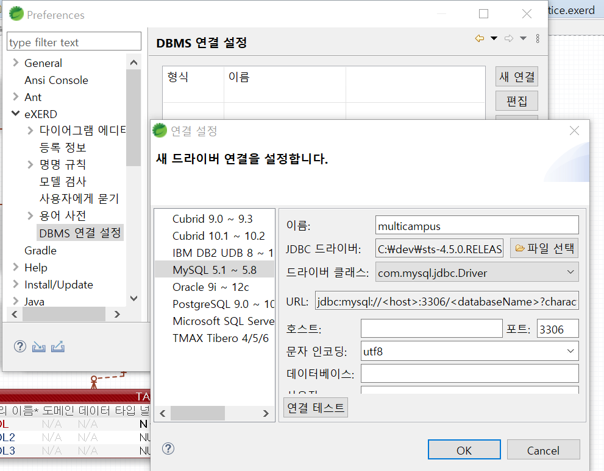

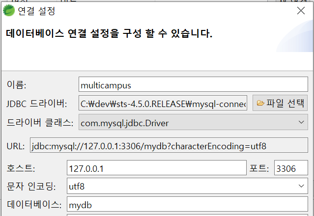

- eXERD -> 포워드 엔지니어링-> 스키마 체크박스 해제 -> ... ->finish
- 만약 my-sql-connector 가 없으면 중간에 DDL코드 복사해서 HeidiSQL 에서 붙여넣어 쿼리 실행하면 테이블이 생성된다

### 리버스 엔지니어링

> DB -> eXERD


