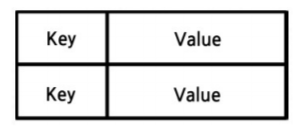
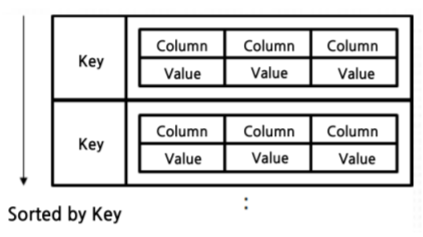
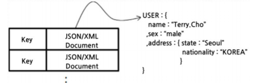
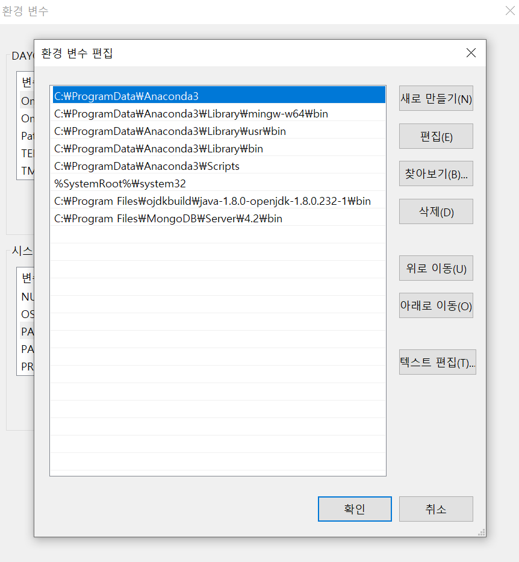
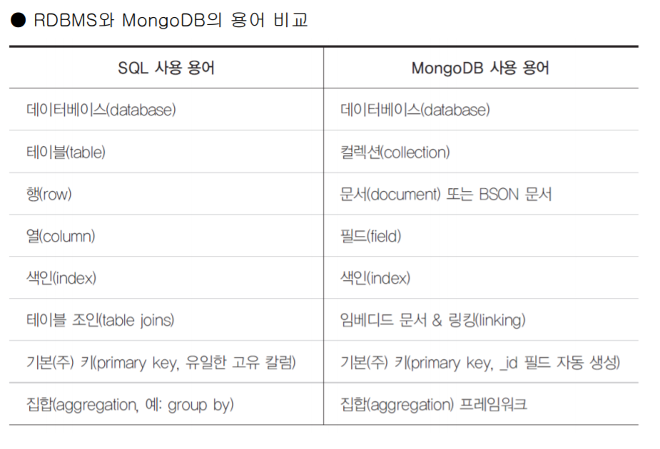
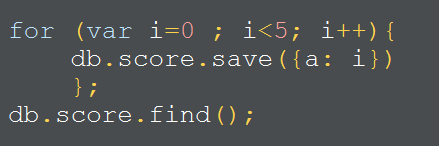
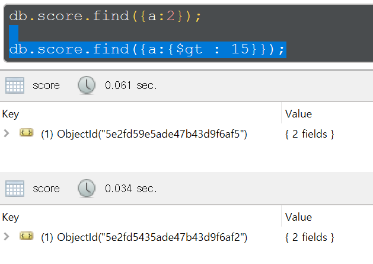
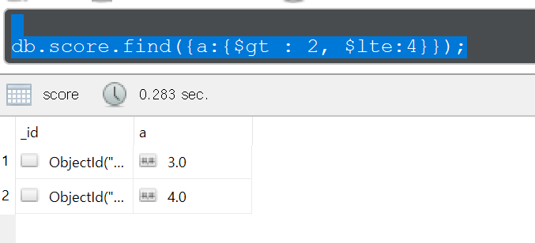
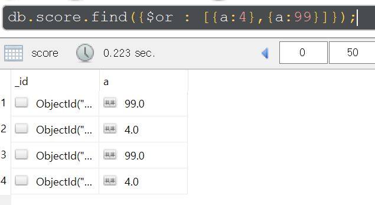

## NoSQL

-  NoSQL은 RDBMS와 다른 형태의 데이터 저장 구조를 총칭
- 다수에 서버에 데이터를 상호 복제(replica)하여 분산(shard) 저장할 수 있기 때문에 특정 서버에 장애가 발생하여도 데이터 유실이 거의 없음
- 하나의 고성능 머신을 사용(Scale up)하지 않고 평범한 다수의 일반 PC를 연결하여 병렬적으로 데이터를 처리하는 구조(Scale out)
- 다만 서버가 다운되었다고 하더라도 alarm이 뜨지 않는다.
- 많은 양의 데이터를 input 하고, 중요하지 않은 데이터(log 데이터 등)일 때 주로 사용한다
- 대표적으로 MongoDB가 있다

#### 장점

- 클라우드 환경에 적합
  -  분산 / 병렬 처리 가능
-  유연한 데이터 모델
  - 비정형 데이터 구조
  -  정해진 스키마를 따르지 않고 다양한 모든 형태를 저장

#### 단점

- 일반적인 서버 – 클라이언트 환경에 적합하지 않음
  - 스키마 고정하지 않음

<br><br>

NoSQL 종류

-  Key / Value  Store
  - 대표적으로 Redis
  - MySQL은 여러대의 PC에서 쓸 때 한 PC에서 작업중이라면 commit 을 할때까지 lock이 걸려서 다른 PC에서 작업할 수 없다.(트랜잭션)
  - 그러나 메모리기반으로 한다면 한 PC에서 lock에 걸리더라도 계속 다른 PC에서 데이터를 추가할 수 있다(빅데이터, 분산 처리에 용이)  



- Ordered Key / Value Store

  -  Key 안에 Column:Value 조합으로 된 여러개의 필드를 가지는 구조
  - 대표적으로 HBase, Cassandra

  

  

- Document Key / Value Store

  -  Document 라는 형태로 구조화된 데이터 형태(JSON, XML, YAML 등) 사용
  - MongoDB, CouchDB

  

- Graph Store
  
  - 모델링 하기 어려운 복잡한 계층 구조를 단순하고 신속하게 사용

<br>

<br>

## MongoDB

- 조회 시작할때 메모리를 사용하는 RDBMS와는 달리, MongoDB는 계속 메모리를 사용
-  스키마를 고정하지 않으므로 다양한 형태의 데이터 저장 가능
- JSON 형태의 데이터 사용(Document)
- Join이 불가능하기 때문에 Join이 필요없도록 데이터를 설계해야 됨
- 주로 데이터를 저장하여 조회만 하고 삭제나 수정이 없는 업무에 적합
- 관계나 트랜잭션이 중요한 금융 / 결제 / 게시판 등의 서비스에는 부적합

<br>

<Br>

#### 환경변수 등록

- mongodb/bin




### 실행

- mongod
- mongod --port [포트번호] --dbpath[데이터경로]  




db확인

```
show dbs
use test
db.test_col.save({'key1': 'value1'})
```

<br>

db에 데이터 저장



조건에 따라 검색(15보다 큰 a 검색)



> and 조건

(2보다 크고 4보다 작은 a 검색)


> or 조건

- a가 5이거나 99인것



