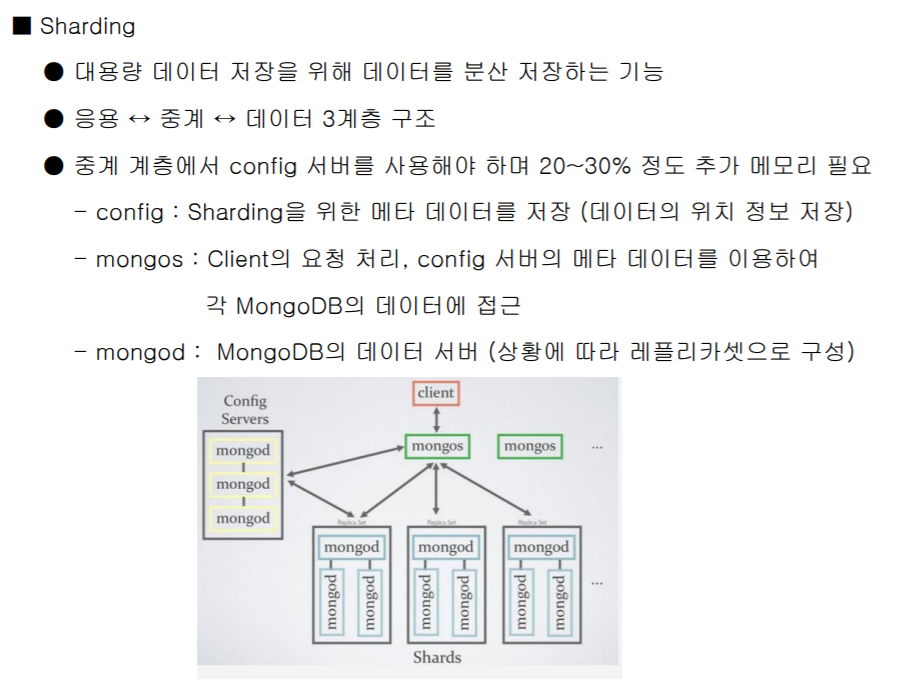
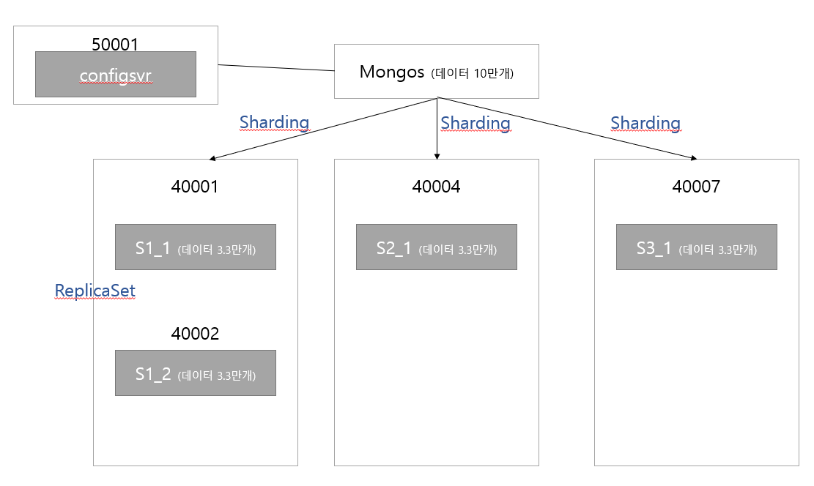

## ReplicaSet

- 한개의 Primary 와 두개의 Secondary로 구성
- 노드끼리 서로 Heartbeat를 이용하여 주기적으로 검사
- Shading 한 서버가 죽으면 데이터가 날아가고, 서버가 죽은 사실도 알 수 없다는 MongoDB의 단점을 보완
- 데이터가 날아가는것을 보완하여 서로 Secondary서버에 Replicaset을 만들어놓는다
- primary는 살아있고, secondary(=replica set)는 죽었을때 primary가 계속 Oplog에 새로운 데이터들을 쌓아두고 있다가, secondary가 살아났을 때 모든 데이터 전송(복구)

<br>

<br>

### ReplicaSet실습하기

1. 데이터 저장 디렉토리 생성
2. 각 디렉토리별로 서버 실행

- mongod 로 실행(dbpath, port 설정)

```
mongod --dbpath c:/data/primary --port 20000 --replSet replica_test

mongod --dbpath c:/data/secondary1 --port 20001 --replSet replica_test

mongod --dbpath c:/data/secondary2 --port 20002 --replSet replica_test
```

3. Primary 서버 접속

```
mongo localhost:20000/admin
```

4. Primary 서버에서 ReplicaSet 환경설정

```
var config = {
 _id:'replica_test', members: [
 {_id:0, host:'localhost:20000'},
 {_id:1, host:'localhost:20001'},
 {_id:2, host:'localhost:20002'}
 ]
};
```

- 환경설정 확인

```
rs.initiate(config)
```

5. Primany 서버에서 데이터 입력

```shell
use log #db선택
for(var i = 0; i < 100; i++) {
 db.connect.save( { ip : "test" + i } )
}   #데이터 입력

show collections #컬렉션 확인

use log #db선택
db.connect.count() #connect컬렉션 데이터 갯수 확인

```

6. Secondary1 서버 접속 후 복제된 데이터 확인

```shell
use log 

rs.slaveOk()   #secondary에서도 명령어 쓸 수 있도록 권한 설정

db.connect.count() #connect컬렉션 데이터 갯수 확인
```

- primary와 동일한 갯수의 데이터가 들어있는것을 확인

7. Secondary 서버 추가 / 삭제 / 확인

```shell
1. 새로운 Secondary 서버 실행 (ex. mongod –port 20003 …)
2. Primary 서버 접속 후 
 rs.add('localhost:20003') #secondary 추가
 3. ReplicaSet 상태 확인
 rs.conf()
 4. rs.remove('localhost:20003')  #secondary 제거
```

- rs.add 하고 secondary 접속해서 명령어 실행시 rs.slaveOk() 하는것을 잊지 말자

<br><br>

## Sharding



- config Server는 설정값만을 가지고 있고, 실제 데이터를 분배하는것은 mongos. mongos는 항상 config server를 참고해서 동작한다
- Config Servers와 mongos 또한 replicaset을 가질 수 있다.

- 계층
  - 응용: client
  - 중계: config server, mongos
  - 데이터 : mongod

```
mongo localhost:40001

use person

db.user.count()
```

<br>
<br>
### sharding 실습하기
> 구조



1. 데이터 서버 구동 및 레플리카 셋 환경설정

- 서버구동

```
mongod --shardsvr --dbpath c:\data\shard1_1 --port 40001 --replSet firstset

mongod --shardsvr --dbpath c:\data\shard1_2 --port 40002 --replSet firstset

```


- 클라이언트

```
mongo localhost:40001/admin

var config = {
 'replSetInitiate' : {
 _id : 'firstset',
 'members' : [
 { _id : 1, host : 'localhost:40001' },
 { _id : 2, host : 'localhost:40002' }
 ]
 }
}
db.runCommand( config )
```

- 서버구동

```
mongod --shardsvr --dbpath c:\data\shard2_1 --port 40004 --replSet secondset
```

- 레플리카셋 환경설정

```
mongo localhost:40004/admin 


var config = {
 'replSetInitiate' : {
 _id : 'secondset',
 'members' : [
 { _id : 1, host : 'localhost:40004' }
 ]
 }
}
db.runCommand( config )
```

- 서버3 구동

```
mongod --shardsvr --dbpath c:\data\shard3_1 --port 40007 --replSet thirdset
```

- 클라이언트에서 레플리카셋 환경설정

```
 mongo localhost:40007/admin
 
 var config = {
 'replSetInitiate' : {
 _id : 'thirdset',
 'members' : [
 { _id : 1, host : 'localhost:40007' }
 ]
 }
}
db.runCommand( config )
```

- config 서버 구동

```
mongod --configsvr --replSet replica --dbpath c:\data\config1 --port 50001
```

- 클라이언트에서 레플리카셋 환경설정

```
mongo localhost:50001/admin

var config = {
 _id:'replica', members: [
 {_id:0, host:'localhost:50001'}
 ]
};
rs.initiate(config)
```

- mongos 서버 구동 (config 서버 등록)

```
mongos --configdb replica/localhost:50001 --port 50000
```

- 클라이언트에서 shard 서버 등록

```
mongo localhost:50000/admin

db.runCommand( { addshard : 'firstset/localhost:40001,localhost:40002' } )
db.runCommand( { addshard : 'secondset/localhost:40004' } )
db.runCommand( { addshard : 'thirdset/localhost:40007' } )

```

- shard 활성화 및 key 등록

```
db.runCommand({enablesharding: 'person'})
sh.shardCollection('person.user', {_id:'hashed'})
```

- mogos 서버에서 데이터 입력 (10만개)

```
use person
for(var i = 0; i < 100000; i++) {
 db.user.save( { name : "test" + i } )
}
```

- 샤드서버 접속 후 데이터 확인(3.3만개)

```
mongo localhost:40001

use person
db.user.count()

```

