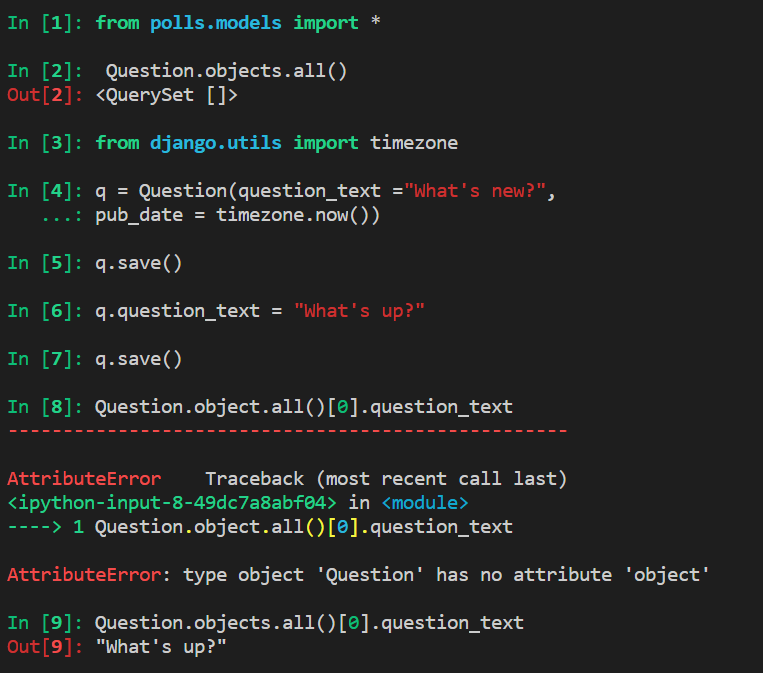

## 장고 (Django)

-  파이썬으로 만들어진 무료 오픈소스 웹 애플리케이션 프레임워크


- MVC 방식 도입(장고에서는 MTV 패턴이라고 한다)

● MTV 패턴 (Model, Template, View) 

	- Model : 데이터 처리 (DB의 테이블) 
	- Template : 클라이언트에게 보여줄 UI (HTML) 
	- View : Controller와 비슷한 역할, 요청을 받은 후 [모델을 실행한 후] 응답

- 장점: 관리자 페이지를 만들어줌

<br>

### 프로젝트 관리 명령어

```
● manage.py : 프로젝트 관리
 - 프로젝트 관리에 필요한 명령어 사용 가능
 - runserver : 서버 실행
 - startapp : 앱 생성
 - createsuperuser : 관리자 생성
 - migrate : 변경사항을 데이터베이스로 반영
 - makemigrations app : app의 모델 변경사항 확인
 - shell : 쉘을 통해 데이터 확인
 - collectstatic : 여러개의 App 에서 사용하는 static 파일을 한 곳으로 모음
```


<br><br>

## VsCode로 장고 시작하기

> Shell에서 (project 만드는 디렉토리 가서 실행)

```shell
django-admin startproject tutorial

code . #vscode 실행
```

> VsCode에서 ctrl+J로 쉘 실행해서 입력

```bash
$ python manage.py startapp firstapp

$ python manage.py runserver
```

- localhost:8000으로 접속 가능하다

> settings.py 수정


----------------------------------------------------------

<br>

### 브라우저로 접속할 수 있는 웹페이지(주소) 생성

> tutorial/urls.py

```python
from django.contrib import admin
from django.urls import path
from firstapp import views  #views는 firstapp에 있기 때문

urlpatterns = [
    path('admin/', admin.site.urls),
    path('index1/', index1),
]
```

>  firstapp/views.py

```python
from django.shortcuts import render
from django.http import HttpResponse

#request라는 인자를 받아야지 urls.py와 연결
def index1(request):  
 return HttpResponse('<h1>Hello</h1>')
```
------------------------------------------------------

- first를 통해 main 페이지 접속

> firstapp/urls.py

```python
from django.urls import path
from . import views
urlpatterns = [
 path('main/', views.main, name='main'),
]
```

> firstapp/views.py

```
from django.shortcuts import render
from django.http import HttpResponse
def index1(request):
 return HttpResponse('<h1>Hello</h1>')
def index2(request):
 return HttpResponse('<h1>Hi</h1>')
def main(request):
 return HttpResponse('<h1>Main</h1>')
```

>  tutorial/urls.py

```python
from django.contrib import admin
from django.urls import path, include #include 추가
from firstapp import views
urlpatterns = [
 path('admin/', admin.site.urls),
 path('index1/', views.index1),
 path('index2/', views.index2),
 path('first/', include('firstapp.urls')),  #firstapp.url로 가도록
]
```

<br>

<br>

### 연습문제

- 프로젝트 second
- 앱 -> secondapp
- url ->second/main
  - main! 출력

-----------------------------------

<br>

<br>

### 데이터베이스 사용하기

>  firstapp/models.py

```python
from django.db import models
class Curriculum(models.Model):
	name = models.CharField(max_length=255)

```

>  settings.py

```python
INSTALLED_APPS = [
 'django.contrib.admin',
 'django.contrib.auth',
 'django.contrib.contenttypes',
 'django.contrib.sessions',
 'django.contrib.messages',
 'django.contrib.staticfiles',
 'firstapp', # firstapp.apps.FirstappConfig
]

#DATABASES 설정
DATABASES = {
 'default': {
 'ENGINE': 'django.db.backends.mysql',
 'NAME': 'django', #mysql에 데이터베이스가 있는지 확인
 'USER': 'root',
 'PASSWORD': '1234', #비번 알맞게 설정
 'HOST': 'localhost',
 'PORT': 3306
 }
}
```

> 모델 내용 mysql에 반영하기

```bash
#정리하기. 모델 클래스가 들어갈 준비
$python manage.py makemigrations 

$python manage.py migrate #실행


```

-----------------
### 관리자 페이지 만들기


> localhost:8000/admin/   으로 가서 로그인을 하면 관리자 페이지 접속
> 

>  관리자 사이트에서 데이터를 제어 할 수 있도록 등록
>
> >  firstapp/admin.py

```python
from django.contrib import admin
from .models import Curriculum

admin.site.register(Curriculum)

```

<br><br>

-------------------------------------

### 템플릿 활용

>  show.htm

```
<body>
	show 페이지<br>
 	{{ list }}<br>
 	
 	<h3>{{item.id}} / {{item.name}}</h3>
 	
</body>
```

>  firstapp/views.py

```
from django.shortcuts import render
def show(request):
 	return render(request, 'firstapp/show.html', {})
 
```


### 기존 mysql에 있는 데이터 활용하기

1. django의 모델 기능을 활용하지 않고 pymysql 모듈을 활용
2. django의 모델 기능을 활용하는데 기존 테이블명과 컬럼명을 수정
   - 기존의 shop 테이블을 장고에서 생성한것처럼 만듦
3. django의 모델 기능을 활용하는데 기존 데이터를 새로 생성된 모델로 이관(migration)
4. 기존 db를 manage.py를 이용하여 models.py 생성

```
settings 에서 

python manage.py inspectdb shop>models.py
```


#### 2번으로 하기

> models.py

```python
class shop(models.Model):
    shop_id = models.IntegerField(max_length=100)
    shop_name = models.CharField(max_length=255)
    shop_desc = models.CharField(max_length=255)
    rest_date = models.CharField(max_length=255)
    parking_info = models.CharField(max_length=255)
    img_path = models.CharField(max_length=255)
```


> terminal

```
$ python manage.py makemigrations
```

<br><br>

### 외래키 활용하기

> models.py

```python
from django.db import models

class Question(models.Model):
    question_text = models.CharField(max_length=200)
    pub_date = models.DateTimeField('date published')
class Choice(models.Model):
    question = models.ForeignKey(Question, on_delete=models.CASCADE)
    choice_text = models.CharField(max_length=200)
    votes = models.IntegerField(default=0)

```


### Shell 사용하기

- 데이터베이스 관련 API 테스트
- ORM의 특징: 조회한번해도 계속 연결되어있음. 수정하면 DB도 수정

> terminal

```
 $ python manage.py shell
```





> [클래스명]_set: 1대다 관계에서 사용


> 질문 다보기, 보기 다 보기


### 연습문제)  문제, 보기 데이터 입력해서 보여주기


<br><Br>

### 관리자 페이지

> http://localhost:8000/admin/

> polls/admin.py

```python
from django.contrib import admin
from .models import Question, Choice
admin.site.register(Question)
admin.site.register(Choice)

```


> models.py

```
class Choice(models.Model):
    question = models.ForeignKey(Question, on_delete=models.CASCADE)
    choice_text = models.CharField(max_length=200)
    votes = models.IntegerField(default=0)

    def __str__(self):
        return self.question + self.choice_text + str(self.votes)


```

<br><Br>

## REST 방식

- ? 안쓰고 /로 파라미터 받아서 html로 출력

> view.py

```pyton
def detail(request, question_id): # 질문 상세 페이지
    return HttpResponse("You're looking at question %s." % question_id)
def results(request, question_id): # 투표 결과 페이지
    response = "You're looking at the results of question %s."
    return HttpResponse(response % question_id)
def vote(request, question_id): # 투표 페이지
    return HttpResponse("You're voting on question %s." % question_id)
```

> polls.urls.py

```python
urlpatterns = [
    path('', views.index, name='index'),
    path('<int:question_id>/', views.detail, name='detail'),
    path('<int:question_id>/results', views.results, name='results'),
    path('<int:question_id>/vote', views.vote, name='vote'),
]

```

---------------------------------

Cross-site request forgery,

: 사이트 간 요청 위조(또는 크로스 사이트 요청 위조)


<br><Br>

### 모델

-  모델은 app/models.py 내의 파이썬 클래스로 표현
- django.db.models.Model 클래스를 상속 받아서 구현
- 모델 클래스를 프로젝트에 반영하기 위해 app 추가(settings.py)
- 
- 


