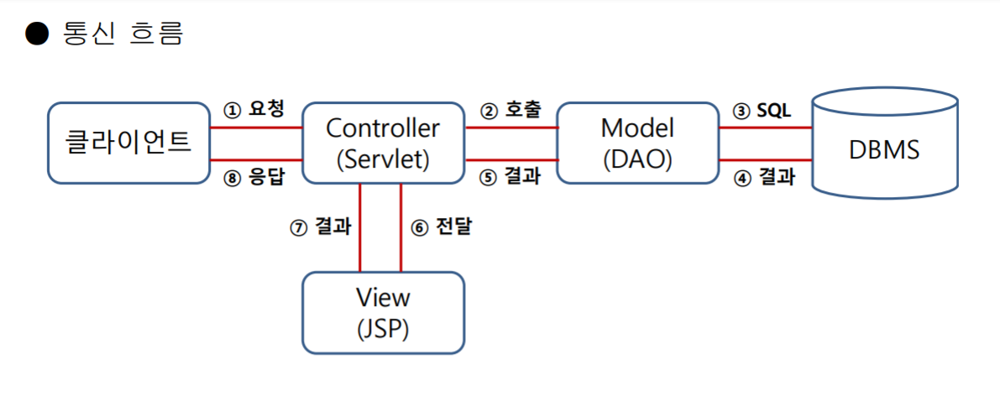

## spring boots 설치하기

1. STS 설치

   - https://spring.io/tools

   - 다운로드 후, 해당 폴더에서 cmd 실행하여 다음과 같이 입력

     ```
     java -jar spring[하고 탭 눌러서 자동완성]
     ```

     

2. Lombok
   - https://projectlombok.org/all-versions
   - java -jar sp[Tab키 누르기] =>압축 해제
   - location을 sts있는 곳으로 설정하여 설치
3. Sts 기본 설정
   - spring starter project 생성
   - type:Gradle(buildship 3.x)
   - New Spring Starter Project Dependencies
     - Lombok
     - Spring Data JPA
     - H2 Database
     - Thymeleaf
     - Spring Web
   
4. 작동원리



