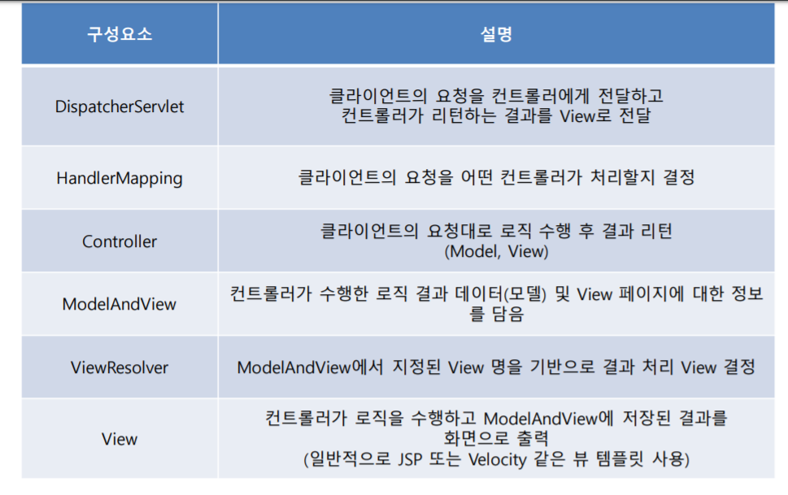
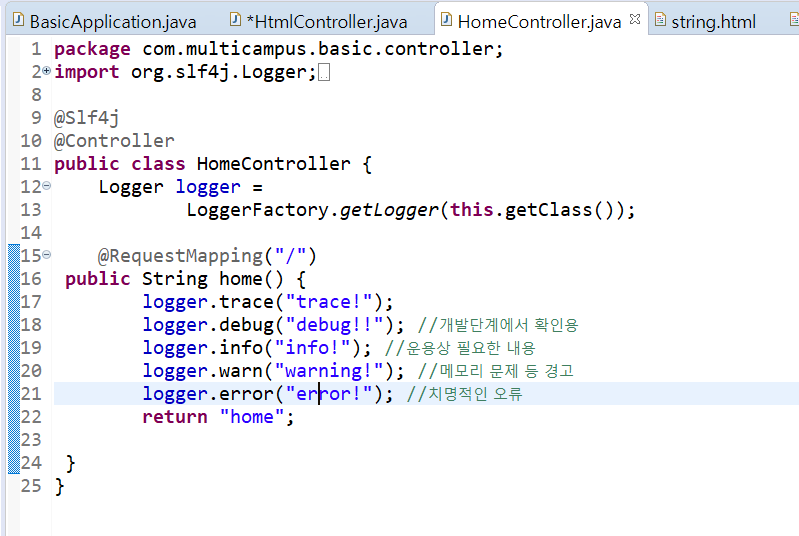
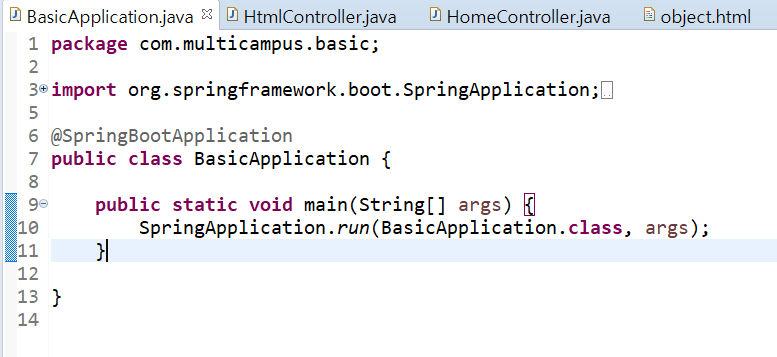
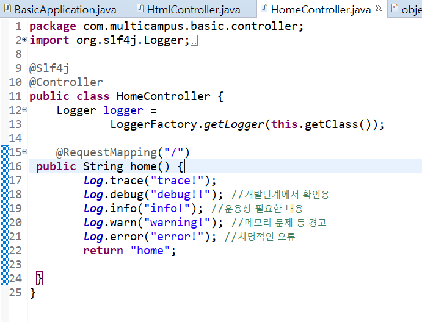
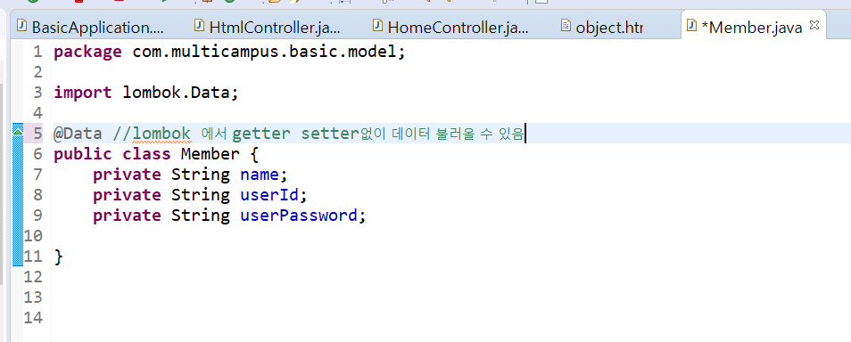
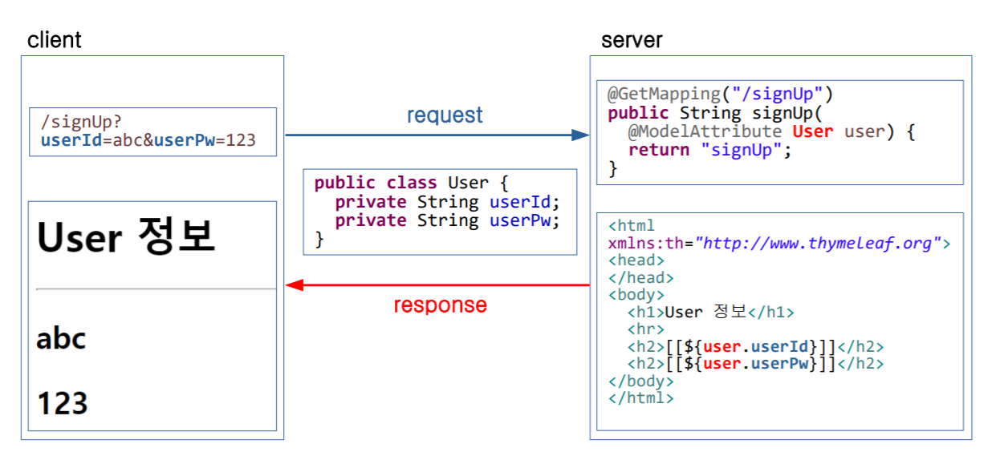
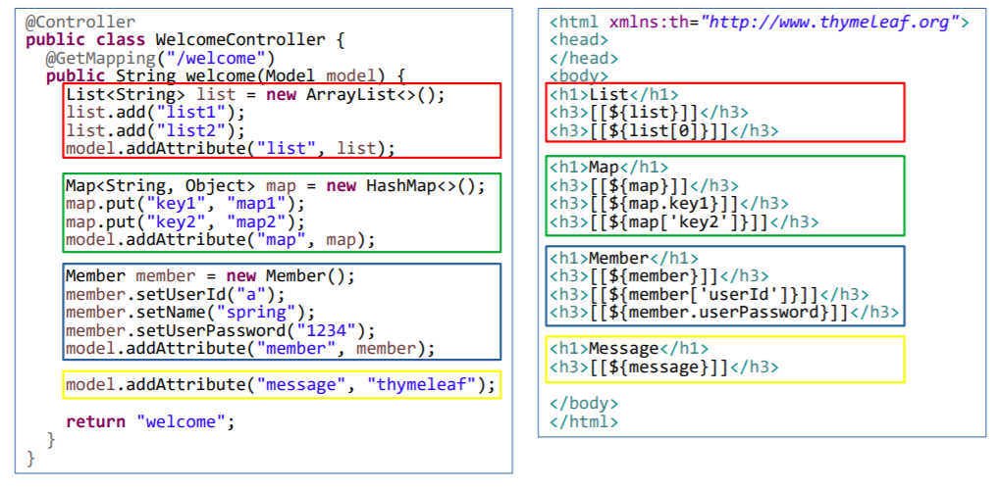

## 메소드

1. @RestController

   - Client의 요청으로부터 View를 반환합니다.

   - @RestController는 객체를 반환할때 객체 데이터는 바로 JSON/XML 타입의 HTTP 응답을 직접 리턴
   - html은 불러오지 못함

2. @Controller

   - templates에서 html을 불러와서 실행
   - 클라이언트의 요청대로 로직 수행 후 결과 리턴 (Model, View)
   - @Controller는 View 기술을 사용

   

3. @getMapping

   - annotation (컴파일러가 알아보는 주석)
   - 해당 주소가 입력되면 동작




4. @RequestMapping
   - get, post 등 어떤 방법으로 request할지 명시할 수 있는 어노테이션
5. loggerFactory
   - 로그를 파일에 저장해주는 역할
   - 출력속도가 빠르다
   - 파일등을 이용하여 관리가 용이하다


※ 단축키

ctrl+shift+ o: 나에게 맞춰 모든 패키지 자동 import

ctrl+shift+F :자동 줄맞춤


※ 설정

- 한글설정
  - window->preference -> encoding 모두 utf-8로 설정




```
@Controller
public class HtmlController {
	@GetMapping("html/string")
	public String html() {  //return 값이 string
		return "html/string"; //templates/html.string
	}

	@GetMapping("html/void")
	public void htmlVoid() {
	}

	@GetMapping("html/map")
	public Map<String, Object> htmlMap(Map<String, Object> map) {
		Map<String, Object> map2 = new HashMap<String, Object>();
		return map2;
	}

	@GetMapping("html/model")
	public Model htmlModel(Model model) {
		return model;
	}

	@GetMapping("html/model_and_view")
	public ModelAndView htmlModel() {
		ModelAndView mav = new ModelAndView();
		mav.setViewName("html/model_and_view");
		return mav;
	}

	@GetMapping("html/object")   // 
	public Member htmlObject() {
		Member member = new Member();
		member.setName("kim");    
		return member;
	}
}
```


### 메인메소드, 컨트롤러, 템플릿 설정하기

1. 메인메소드



2. home 페이지 설정



콘솔에 로그 뜨도록 설정

@Slf4j를 이용하면 좀 더 쉽게 만들 수 있음


3. html에 연결되도록 getmapping

```java
@Controller
public class HtmlController {
	@GetMapping("html/string") 
	public String html() { 
		return "html/string"; 
	}

	@GetMapping("html/void")
	public void htmlVoid() {
	}

	@GetMapping("html/map")
	public Map<String, Object> htmlMap(Map<String, Object> map) {
		Map<String, Object> map2 = new HashMap<String, Object>();
		return map2;
	}

	@GetMapping("html/model")
	public Model htmlModel(Model model) {
		return model;
	}

	@GetMapping("html/model_and_view")
	public ModelAndView htmlModel() {
		ModelAndView mav = new ModelAndView();
		mav.setViewName("html/model_and_view");
		return mav;
	}

	@GetMapping("html/object")   
	public Member htmlObject() {
		Member Member = new Member();
		Member.setName("kim");
		Member.setUserId("katy");
		return Member;
	}
}
```

>  object page는 Member.html 파일을 열어서 보여주는데, Member에 직접 데이터를 setting 해서 보내준다


4. private 변수 만들기



>  class에서 init변수 만들때 `__init__`으로 만들고, getter setter로 접근할 수 있게 만든것처럼, member의 변수는 private하다

>  gettersetter 없이 접근할 수 있게 하는것이 lombok의 @Data이다

### 응답방식

- HTML : String
- JSON : map,array,list,object
  - 데이터만 서버에서 가져오는 경우 JSON형식으로 가져오는것이 일반적이다
  - JSON을 html에서 제공해주려면 parser가 필요하다
  - controller에서 json 데이터를 주고받기 위해서는 @responseBody 가 필요하다
- Responsebody 자동으로 붙여주는 controller: @RestController


### Http Method

- 요청 처리 방식 
  - get: 데이터 가져오기
  - post :데이터 저장
  - put: 데이터 수정
  - delete: 데이터 삭제
- 이 모든것을 크롬 브라우저에서 경험해보려면 크롬에서 restlet client를 검색해서 talend API tester 다운받기

```java
package com.multicampus.basic.controller;

import org.springframework.web.bind.annotation.DeleteMapping;
import org.springframework.web.bind.annotation.GetMapping;
import org.springframework.web.bind.annotation.PostMapping;
import org.springframework.web.bind.annotation.PutMapping;
import org.springframework.web.bind.annotation.RequestMapping;
import org.springframework.web.bind.annotation.RequestMethod;
import org.springframework.web.bind.annotation.RestController;

@RestController
public class MethodController {
	@GetMapping("req/get")
	@RequestMapping(value = "req/get", method = RequestMethod.GET)
	public String get() {
		return "GET";
	}

	@PostMapping("req/post")
	@RequestMapping(value = "req/post", method = RequestMethod.POST)
	public String post() {
		return "POST";
	}

	@PutMapping("req/put")
//	@RequestMapping(value = "req/put", method = RequestMethod.PUT)
	public String put() {
		return "PUT";
	}

	@DeleteMapping("req/delete")
//	@RequestMapping(value = "req/delete", method = RequestMethod.DELETE)
	public String delete() {
		return "DELETE";
	}

}
```

- rest 방식

같은 주소에 매소드 방식(접근방식)에 따라 달리 작동하도록 설정해두는 방식. 주소, 게시글 등 페이지를 관리하기가 더 용이하다.


### 요청처리(request하면서 값을 보내는 방식, 형식)

1. RequestParam(편리함)

- 파라미터의 종류 갯수와 상관없이 요청 처리 
- 파라미터 명칭에 맞게 변수 사용 (컨트롤러 메소드의 인자명과 동일)
- 보안 약함
- ex1) key1, key2 정확하게 파라미터 받기


* ex2) 어떤 파라미터든 받을 수 있게


2. ModelAttribute(명확함)

* Model에 작성되어 있는 변수/자료형과 파라미터명이 동일하면 자동으로 대입
* 모델 클래스의 변수명과 동일

- Model/DTO/VO 등 객체와 연계하여 활용
- 깐깐한 조건을 다 만족해야 request 처리
- JPA, MyBatis 등 ORM 프레임워크 활용
- 개발자 입장에서 controller에서 key에게 바로 key를 셋팅할 수 있는 RequestParam와는 다르게, ModelAttribute는 class를 만들어 key를 관리하기 때문에 한번 더 생각하고, 확인하고,getter setter를 통해 key를 private하게 관리할 수 있다.



3. HttpServletRequest - 가장 전통적으로 사용되는 방식
4.  @PathVariable -  요청을 처리하는 주소에 {변수명} 형식으로 지정

#### 실습하기

```java
package com.multicampus.basic.controller;

import javax.servlet.http.HttpServletRequest;

import org.springframework.web.bind.annotation.GetMapping;
import org.springframework.web.bind.annotation.RequestParam;
import org.springframework.web.bind.annotation.RestController;

@RestController
public class RequestController {
	@GetMapping("req/http")
	public String http(HttpServletRequest request) {
		String name = request.getParameter("name");
		String pageNum = request.getParameter("pageNum");
		return name + ", " + pageNum;
	}

	@GetMapping("req/param1")
	public String param1(
			@RequestParam("key1") String key1,
			@RequestParam("key2") String key2) {
		return key1 + ", " + key2;
	}

}
```


```
http://localhost:8080/req/param1?key1=a&key2=b
```

>  key1과 key2의 값을 넣어 요청하면 a,b를 출력

```
http://localhost:8080/req/param2?key1=a&key2=b&&key=12345
```

>  {key1=a, key2=b, key=12345} 이런식으로 보여준다


### 로그인 화면 만들기

- get방식으로 접근했을때에는 로그인 입력창 보이기(login.html 불러오기)
- 로그인 정보 입력시 post 방식으로 접근하게됨=>로그인 결과 보여주기
  - boot/ 1234입력시 "로그인 성공" 이 나오는 조건

* controller

```java
package com.multicampus.basic.controller;

import org.springframework.stereotype.Controller;
import org.springframework.web.bind.annotation.GetMapping;
import org.springframework.web.bind.annotation.PostMapping;
import org.springframework.web.bind.annotation.RequestParam;
import org.springframework.web.bind.annotation.ResponseBody;

@Controller 
public class LoginController {
	@GetMapping("/Login")  //브라우저에서 get방식으로 접근시 login.html을 보여줌
	public String login() {
		return "login";
	}
	@PostMapping("/Login")  //post방식으로 접근시 (ResponseBody를 통해)JSON파일 가져와 보여줌
	@ResponseBody
	public String loginPost(
			@RequestParam("id") String id,  //requestParam방식; 정확히 키 입력해야함
			@RequestParam("pw") String pw
			) {
		
		String dbId= "boot";
		String dbPw = "1234";
		
		if(dbId.equals(id) && dbPw.equals(pw)) {
			return "로그인 성공";
		}
		return "로그인 실패";
	}

}

```

* login.html

```html
<!DOCTYPE html>
<html>
<head>
<meta charset="UTF-8">
<title>Insert title here</title>
</head>
<body>
	<form method="post" action="/Login">
	ID : <input type="text" name="id"><br>
	PW : <input type="text" name="pw"><br>
	
	<input type="submit">
	
	</form>
</body>
</html>
```


###  HTML Template – Thymeleaf


컨트롤러가 요청 받아서 처리하고 응답 주기전에 html에게 작업을 넘겨 처리후 response

html작업 넘길 때 단서를 줘서 특정하게 동작하도록 하는 기술




### thymeleaf 를 이용한 html페이지에서 변수 표현하는 방법 3가지

```html
<!DOCTYPE html>
<html xmlns:th="http://www.thymeleaf.org">
<head>
<meta charset="UTF-8">
<title>Insert title here</title>
</head>
<body>
	아이디:<span>[[${user.userId}]]</span>
	<br> 
	이름:	<span>[[${user.userName}]]</span>
	<br> 
	나이:	<span>[[${user.userAge}]]</span>
	<br>
	<hr>
	아이디:<span th:text="${user.userId}"></span><br> 
	이름:	<span th:text="${user.userName}"></span><br> 
	나이:	<span th:text="${user.userAge}"></span><br>
	<hr>
	아이디:<span data-th-text="${user.userId}"></span><br> 
	이름:	<span data-th-text="${user.userName}"></span><br> 
	나이:	<span data-th-text="${user.userAge}"></span><br>
</body>
</html>
```


### Thymeleaf ) 하나씩 for문처럼 뽑아내기 방법 2가지

> 테이블 형식을 쓸 때 사용한다
>
> for each 와 동작하는 방식이 비슷하다고 생각하면 된다

```html
</tr>
<tr th:each="user : ${userList}">
<td th:text="${user.userId}"></td>
<td th:text="${user.userName}"></td>
<td th:text="${user.userAge}"></td>
</tr>
</table>
<hr>
<th:block th:each="pageNumber : ${#numbers.sequence(1, 10)}">
<span th:text="${pageNumber}></span>
```


### Thymeleaf ) 조건문

* if 문

> unless: else와 같음. if문과 형식 똑같이 써야한다

* 삼항연산자
* switch문

```html
<body>
 관리자 이름 :
    //if문
 <span th:if="${name} != null" th:text="${name}"></span>
 <span th:unless="${name} != null" th:text="이름없음"></span>
 <br>
    //삼항연산자
 권한 : <span th:text="${auth} != null ? ${auth} : '권한없음'"></span><br>
 담당 카테고리 :
 <span th:switch="${category}">
 <span th:case="1">커뮤니티</span>
 <span th:case="2">장터</span>
 <span th:case="3">갤러리</span>
 </span><br>
</body>
```

> 그냥 /mode로 호출하면 "권한없음으로 나옴
>
> > `http://localhost:8080/mode?name=이름&auth=권한&category=1`:이런식으로 주소를 입력해야 한다.


### Thymeleaf ) default 기본값(파라미터) 설정하기

```java
 @GetMapping("pagination")
 public String pagination(Model model, @RequestParam(defaultValue="1") int page) {
 int startPage = (page - 1) / 10 * 10 + 1;
 int endPage = startPage + 9;
 model.addAttribute("startPage", startPage);
 model.addAttribute("endPage", endPage);
 model.addAttribute("page", page);
 return "pagination";
 }
```

* request할때 값을 입력해주지 않으면 default값은 1이다
* page ==20일때 11~20페이지 보여주기 위해 page -1을 함
* page/10*10을 하게 되면 십의자리만 뽑아준다

   ```html
<body>
 <th:block th:each="pageNumber : ${#numbers.sequence(startPage, endPage)}">
 <span th:if="${page} == ${pageNumber}" th:text="${pageNumber}"
 style="font-weight:bold"></span> //현재페이지는 bold처리하기
 <span th:unless="${page} == ${pageNumber}" th:text="${pageNumber}"></span>
 </th:block>
</body>

   ```


### Thymeleaf ) 하이퍼링크 설정하기

```java
	@GetMapping("/linkUrl")
	public String linkUrl(
//			@RequestParam int start,
//			@RequestParam int end,
			@RequestParam (defaultValue="1") int now_page,
			Model model) {
		int start = (now_page-1)/10*10+1;
		int end = start + 9;
		model.addAttribute("start",start);
		model.addAttribute("end",end);
		model.addAttribute("now_page",now_page);
		return "linkUrl";
	}

```


```html
<body>
	<th:block th:each="page : ${#numbers.sequence(start,end)}">
		<span th:if = "${now_page==page}" th:text = "${page}"></span>
		<a href="#" th:unless="${now_page==page}">[[${page}]]</a>
	
	</th:block>
</body>
```


