### HTTP

> Hyper Text Transfer Protocol [Secure]

- 암호화 하여 데이터를 전송시킨다.(보안)
- 중간에 해커가 정보를 가로채도 암호화되어있어 해독할 수 없음
- secure라는 인증서를 사서 서버에 업로드하면 http 웹서비스 실행
- 상태를 기억하지 않는다(stateless)
  - request하고 response받은적이 있다고 하더라도 서버는 상태를 기억하지 않기 때문에 다시 request할때 다시 정보를 넣어 request해야한다
  - 따라서 response를 받으면 client의 cookie에 정보가 저장되어 다음에 서버 request시 상태가 반영될 수 있도록 한다


- Cookie

>__클라이언트 상__에 정보를 저장.
>
> 기본적으로 웹서버에서 PC로 보내는 작은 파일 저장. 사용자 인증 도와준다. 만료기간이 있어 시간이 지나면 자동 삭제 된다.


  - (참고)Cache

> 캐시는 웹 페이지 요소를 저장하기 위한 임시 저장소이다. 특히, 후에 필요할 것 같은 요소들을 저장한다. 이러한 요소들은 그림 파일이나 문서 파일 등이 될 수 있다.


### Session

- 클라이언트에 대한 정보를 __서버__에 저장할 수 있는 공간
- __접속하는 클라이언트 당(브라우저 당) __하나의 세션 생성
- 사물함과 같은 형식으로 저장이 되며 사물함 번호를 클라이언트로 전송
- 번호를 분실하는 경우 새로운 세션 생성하고 다시 클라이언트로 전송
- 설문조사와 같이 여러 단계로 정보 입력시, 로그인 후 사용 내역 저장 등 활용


### Session 실습하기: Login

> controller

```java
@Controller
public class SessionController {
	@GetMapping("/login")
	public String login() {
		return "login";
	}

	@PostMapping("/login")
	public String loginPost(User user, HttpSession session) { 
        //@ModelAttribute("user") User user
        // 세션은 어디서든지(현재 스프링 서버) 사용 가능
		session.setAttribute("user", user);
		return "redirect:/main";  //컨트롤러에서 다 처리하지 않고 /main으로 이동(떠넘김)
	}

	@GetMapping("/main")
	public String main() {
		return "main";
	}
}
```


> main.html

```html
<body>
 <p th:if="${session.user} != null"
 th:text="${session.user.userId} + '님 반갑습니다.'"></p>
 <p th:unless="${session.user} != null">로그인되어 있지 않습니다.</p>
</body>
```

> login.html

```html
<body>
 <form action="/login" method="post">
 ID : <input type="text" name="userId"><br>
 PW : <input type="password" name="userPw"><br>
 <input type="submit" value="로그인">
 </form>
</body>

```


> 로그인을 하지 않고 main페이지로 들어가면 "로그인이 되어있지 않습니다"가 뜬다
>
> > 한번 로그인 하면 쿠키 정보가 session에 연결되기 때문에 main에 가더라도 사용자 인증이 된 상태가 된다.


## AOP

>  Aspect Oriented Programming

- 공통적으로 적용될 모듈(클래스/메소드)을 만든 후 적용하고자 하는 부분의 코드 밖에서 삽입하는 방법

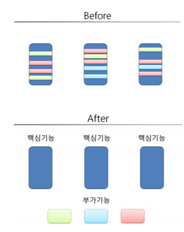

- 사용분야
  - 메소드의 성능 테스트
  - 트랜잭션 처리(중간에 하나라도 오류가 생기면 트랜잭션 자체를 취소. for 충돌방지, 하나의 과정이 순차적으로 끝까지 꼭 처리되어야하는 업무)
  - 예외반환
  - 로깅, 인증, 권한처리
- 파이썬의 데코레이션과 같은 기능
- 용어

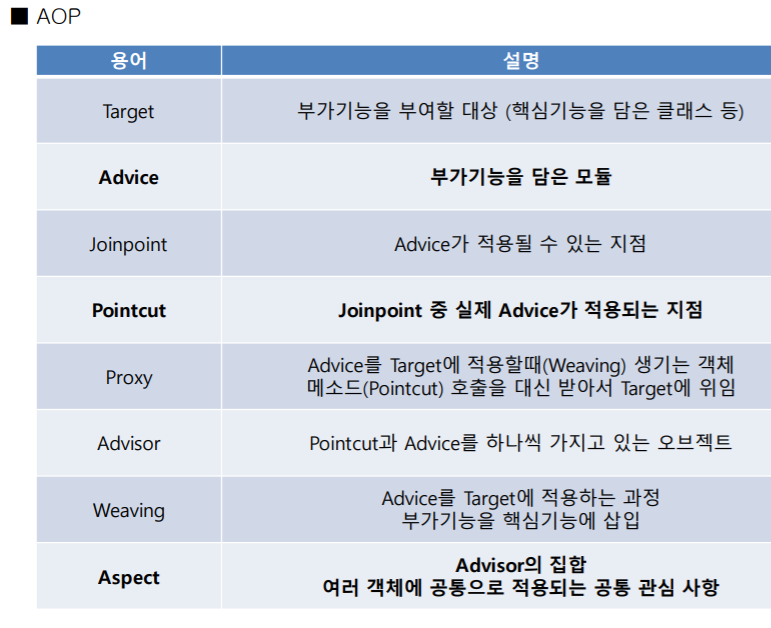

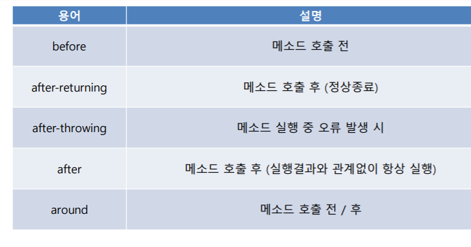

> 스프링의 두가지 특성

- IoC/DI 
  - Inversion of Control/ Dependency Injection)
  - 제어권을 스프링이 가지고 있음.
- AOP
  - 관점지향 프로그램


## AOP 실습하기

> controller

```java
@Slf4j
@Aspect
@Component
public class ControllerAspect {
	@Before(value = "execution (* com.multicampus.basic.controller.*.*(..))")
	public void onBeforeHandler(JoinPoint joinPoint) {
		log.debug("@Before run");
	}

	@After(value = "execution (* com.multicampus.basic.controller.*.*(..))")
	public void onAfterHandler(JoinPoint joinPoint) {
		log.debug("@After run");
	}

	@AfterReturning(value = "execution (* com.multicampus.basic.controller.*.*(..))", returning = "data")
	public void onAfterReturningHandler(JoinPoint joinPoint, Object data) {
		if (data != null) {
			log.debug(data.toString());
		}
		log.debug("@AfterReturning run");
	}
}
```

> basic.controller에 있는 사이트에 들어갈때마다 @Before run, @After run 등 로그 기록이 콘솔에 뜬다
>
> > 만약 뜨지 않는다면 static.application.properties에
>
> > `logging.level.com.multicampus.basic=trace`를 입력하기 


## ControllerAdvice

-  Controller에서 발생되는 오류를 감지하고 처리해주는 기능
-  사용 이유
  - 예외처리를 한 곳에 묶어서 편하게 관리
  - 처리가 제대로 되지 못한 부분에 예외가 발생되는 경우 브라우저에 Exception Message가 노출되어 버리는데 모든 예측하지 못한 예외도 한꺼번에 처리 가능
- request 했는데 오류 발생 -> 오류에 해당하는 ControllerAdvice 찾아 response

```java
@ControllerAdvice
public class MyControllerAdvice {
 @ExceptionHandler
 [@ResponseStatus]
 [@ResponseBody] //json으로 응답을 줌
 public String handle(RuntimeException e, WebRequest request) {
 return [view]; 
 }
}
```

> 또는 AOP에서 `*.*` 모든클래스 모든 메소드를 선택하는 것이 아니라 부분적으로 선택해서 Log.를 에러메세지 보내도록 하는 방법도 있다.


## filter

> 비교


|AOP|Filter|Interceptor|
|------|---|---|
|어떤 클래스든 어떠한 메소드든 대상이 된다|접속하는 주소(url)대상|접속하는 주소(url)대상|
|     |자바의 고유기능|자바의 고유기능|

- HTTP 요청과 응답을 변경 할 수 있는 클래스
- 사용 분야
  - XSS (Cross Site Scripting) 방지
  - Logging 
  -  Encoding 
  -  IP 검사 등
- 서버에 접속하기 전 필터를 거쳐 접속(request)하고 response하는 구조(for 보안, 조건확인 등)

> filter파일

```java
@Slf4j
public class IPCheckFilter implements Filter {
@Override
public void doFilter(
 ServletRequest request, ServletResponse response, FilterChain chain)
 throws IOException, ServletException {
log.debug("filter begin");
HttpServletRequest req = (HttpServletRequest) request;
String ip = request.getRemoteAddr();
log.debug("ip : " + ip);
chain.doFilter(req, response);
log.debug("filter end");
}
}
```

> 필터가 적용되려면 configuration에 필터를 등록해야한다

```java
@Configuration
public class FilterConfig {
@Bean
public FilterRegistrationBean<Filter> getFilterRegistrationBean() {
FilterRegistrationBean<Filter> bean =
new FilterRegistrationBean<>(new IPCheckFilter());
bean.addUrlPatterns("/visitor"); //visitor에 갈때마다 필터 적용
return bean;
}
}
```


## Interceptor

■ Interceptor 

● Controller에 들어오는 요청 및 응답을 가로채는 역할 

● Filter와 유사하지만 동작하는 시기가 다름 

● 주요 메소드 - preHandler() : Controller의 메소드가 실행되기 전 (요청)

- postHandler() : Controller의 메소드가 실행된 후 (응답)
- afterCompletion() 
-  View가 Rendering 된 이후

> Interceptor 파일

```java
@Component
@Slf4j
public class SignInCheckInterceptor extends HandlerInterceptorAdapter {
	@Override
	public boolean preHandle(HttpServletRequest request, HttpServletResponse response, Object handler)
			throws Exception {
		log.debug("preHandle");
		HttpSession session = request.getSession();
		User user = (User) session.getAttribute("user");
		if (user == null) {
			response.sendRedirect("/login");
		}
		return super.preHandle(request, response, handler);
	}

	@Override
	public void postHandle(HttpServletRequest request, HttpServletResponse response, Object handler,
			ModelAndView modelAndView) throws Exception {
		log.debug("postHandle");
		super.postHandle(request, response, handler, modelAndView);
	}

	@Override
	public void afterCompletion(HttpServletRequest request, HttpServletResponse response, Object handler, Exception ex)
			throws Exception {
		log.debug("afterCompletion");
		super.afterCompletion(request, response, handler, ex);
	}
}
```


> config파일

```java
@Configuration
public class InterceptorConfig implements WebMvcConfigurer {
	@Autowired
	private SignInCheckInterceptor signInCheckInterceptor;

	@Override
	public void addInterceptors(InterceptorRegistry registry) {
		registry.addInterceptor(signInCheckInterceptor).addPathPatterns("/main"); //main으로 갈때마다 intercept해서 로그인하게 함
		WebMvcConfigurer.super.addInterceptors(registry);
	}
}
```


## JPA

- Java Persistence API
-  ORM 프레임워크 (Object Relational Mapping) - 객체는 객체대로, 관계형 데이터베이스는 관계형 
  - 객체는 객체대로, 관계형 데이터베이스는 관계형 데이터베이스대로 설계
- 파이썬의 sql alchemy와 비슷
- 특징
  - DAO와 Database Table의 강한 의존성 문제 해결
  - Model(자바 클래스)을 작성하면 자동으로 Table 생성
  -  SQL 문장을 이용하지 않고 메소드를 호출하면 자동으로 SQL 문장 실행
- 장점
  - 생산성 향상
  - 유지보수
  - 특정 벤더(DB; Oracle, MSSQL 등)에 종속적이지 않음

> application.properties

```java
#log level
logging.level.com.multicampus.basic=trace

# datasource
spring.datasource.url=jdbc:h2:~/test
spring.datasource.driverClassName=org.h2.Driver
spring.datasource.username=sa
spring.datasource.password=

# jpa
spring.jpa.hibernate.ddl-auto=update
spring.jpa.database-platform=org.hibernate.dialect.H2Dialect
spring.jpa.show-sql=true
```


## H2 데이터베이스 설치

-  https://h2database.com/html/main.html
  - 다운로드
- H2 Database란?

> 자바로 작성된 관계형 데이터 베이스 관리 시스템.
>
> 서버모드와 임베디드 모드의 인메모리 DB기능을 지원.
>
> 브라우저 기반의 콘솔모드를 이용할 수 있으며, 별도의 설치과정이 없고 저용량이라 가볍고 빠른것이 특징.

- 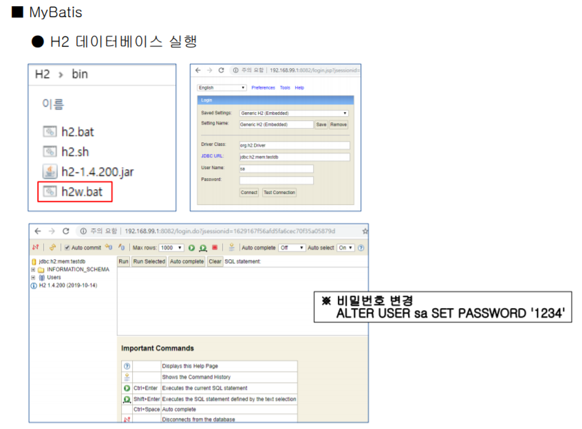


## JPA 실습하기

> model파일 만들기

```java
package com.multicampus.basic.model;

import javax.persistence.Entity;
import javax.persistence.GeneratedValue;
import javax.persistence.GenerationType;
import javax.persistence.Id;

import lombok.Data;

@Data
@Entity //테이블을 만들때 필요한 정보를 가져오는 매서드
public class Product {
	@Id
	@GeneratedValue(strategy = GenerationType.AUTO)
	private long id;
	private String name;
	private int price;
	private int count;
}
```

* 메모리에 등록하는 어노테이션. 불리어질 대상 (Autowired로 연결하여 spring이 자동으로 제어하게 한다)
  * @Controller
  * @Service
  * @Repository
  * @Component

> repository
>
> > 실제로 db를 관리하는 곳
> >
> > 메모리에 등록해주는 역할
> >
> > interface : 상속받음
> >
> > > Product라는 table 대상, Long이라는 id

```java
@Repository
public interface ProductRepository extends JpaRepository<Product, Long> {
}
```

>Controller
>
>> Autowired = 자동으로 Repository를 연결해줌 (메모리에 올라와있는 것 중)

```java
@RestController
public class JpaController {
@Autowired // 자동으로 만듦
ProductRepository productRepository; //초기화 없이 주입
@GetMapping("/jpa/product")
public List<Product> product() {
List<Product> list = productRepository.findAll();
return list;
}
@PostMapping("/jpa/product")
public String productPost(@ModelAttribute Product product) {
productRepository.save(product); //save 알아서 매소드 호출(삽입).매소드가 실행후 product에 반환
return "redirect:/jpa/product";
}
}
```


> POST 방식으로 Product Table(데이터베이스)에 정보 입력 
>
> > Talend API 크롬 확장프로그램 이용

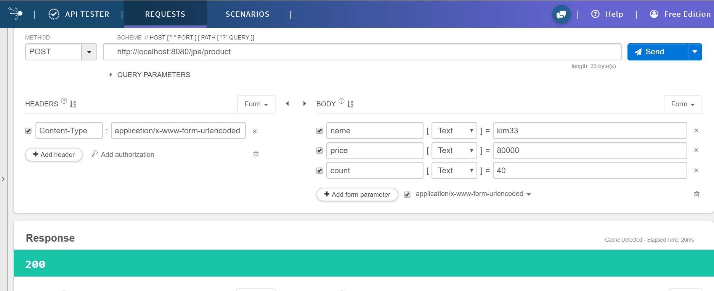


> H2에 접속하여 SQL 구문으로 테이블 호출

```sql
SELECT * FROM PRODUCT
```

### <br>

<br>


### SQL구문 대신 Spring repository에서 Java구문으로 데이터 필터링하기


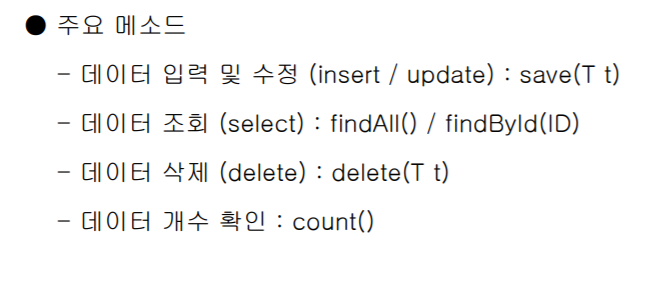/

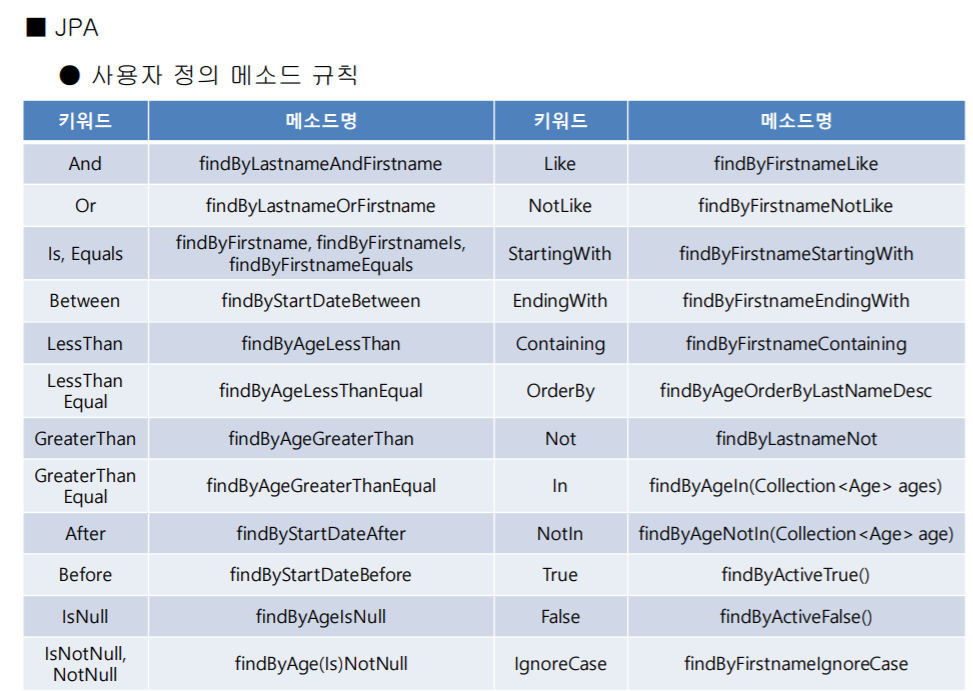

##### 이름이 kim인 사람만 테이블에서 불러오기
> Controller
>
> > 단 Product 하나만을 불러오기 때문에 name은 중복되지 않는 고유한 값이어야 한다
> >
> > > 중복되는 값을 key값으로써 불러오기 위해서는 1) List형식으로 불러오거나 2) 예외처리를 해야한다
```java
	@GetMapping("/jpa/product2")
	public Product product2(String name) {
		Product list = productRepository.findByName(name);
		return list;
	}
```

> Repository

```java
@Repository
public interface ProductRepository extends JpaRepository<Product, Long> {
	public Product findByName(String name);
}
```

> webpage

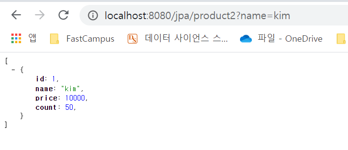

###### <br>

###### 중복되는 값을 key값으로써 불러오기 위해 List형식으로 불러오기

> Controller

```java
@GetMapping("/jpa/product2")
	public List<Product> product2(String name) {
		List<Product> list = productRepository.findByName(name);
		return list;
	}
```

> Repository

```java
@Repository
public interface ProductRepository extends JpaRepository<Product, Long> {
	public List<Product> findByName(String name);
}
```

> web

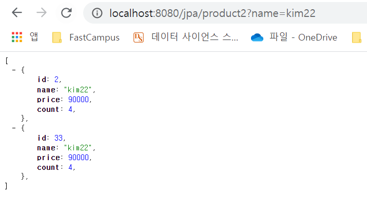

<br><br>

#### H2를 서버에서 실행하기

- embeded 모드 : 로컬에서만 접속가능
- sever 모드: 어떤 장치에서든 접속 가능

> h2설정변경

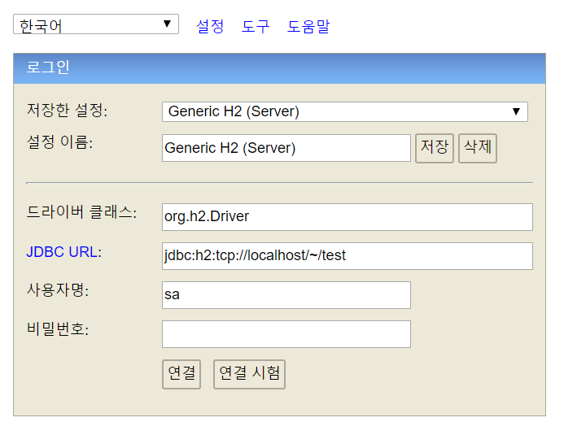

> application.properties

```java
# h2 server mode
spring.datasource.url=jdbc:h2:tcp://localhost/~/test
```


<br>

### 파일 업로드 페이지

1. MultipartHttpServletRequest 이용하기

> controller/UploadController (오리지널 파일 이름 확인하기)

```java
@Controller
public class UploadController {
@GetMapping("/upload1") //파일 업로드 화면은 get
public String upload1() {
return "upload1";
}
@PostMapping("/upload1") //파일 업로드 submit시에는 post방식으로 접근(파일명 확인. 저장X)
@ResponseBody
public String upload1Post(MultipartHttpServletRequest mRequest) {
String result = "";
MultipartFile mFile = mRequest.getFile("file");  //html의 name으로 파일(mutipartfile) 확인
String oName = mFile.getOriginalFilename();
result += oName + "\n";
return result;
}
}
```

> controller/UploadController (업로드한 파일들 저장하기)

```java
@Controller
public class UploadController {
	@GetMapping("/upload1")
	public String upload1() {
		return "upload1";
	}

	@PostMapping("/upload1")
	@ResponseBody
	public String upload1Post(MultipartHttpServletRequest mRequest) {
		String result = "";
		// 여러개의 파일을 담는 list 형식. 반복문이 가능하다
		List<MultipartFile> mFiles = mRequest.getFiles("file");
		for (int i = 0; i < mFiles.size(); i++) {
			
			// 업로드된 파일 정보
			MultipartFile mFile = mFiles.get(i);
			// original 파일명을 알아내기
			String oName = mFile.getOriginalFilename();
			// 지정 경로에 지정 파일명으로 저장(original 파일명으로)
			try {
				mFile.transferTo(new File("c:/dev/" + oName));
			} catch (IllegalStateException e) {
				// TODO Auto-generated catch block
				e.printStackTrace();
			} catch (IOException e) {
				// TODO Auto-generated catch block
				e.printStackTrace();
			}
			result += oName + "\n";
		}
		return result;
	}
```


> templates/upload1. html

```html
<meta charset="utf-8">
<form method="post" enctype="multipart/form-data">
 <input type="file" name="file" multiple><br>
 <input type="submit" value="업로드">
</form>
```
> application.properties
```java
# file upload
spring.servlet.multipart.max-file-size=2097152  //파일 1개의 용량 제한
spring.servlet.multipart.max-request-size=2097152 //한번의 업로드(request)당 용량 제한
```


2. RequestParam으로 받기

> controller

```java
@GetMapping("/upload2")
public String upload2() {
return "upload2";
}
@PostMapping("/upload2")
@ResponseBody
public String upload2Post(@RequestParam("file") MultipartFile mFile) {
String result = "";
String oName = mFile.getOriginalFilename();
result += oName + "\n";
return result;
}
```

> templates

 ```html
<meta charset="utf-8">
<form method="post" enctype="multipart/form-data">
 <input type="file" name="file" multiple><br>
 <input type="submit" value="업로드">
</form>
 ```

3. ModelAttribute로 받기

> Controller

```java
@GetMapping("/upload3")
public String upload3() {
return "upload3";
}
@PostMapping("/upload3")
@ResponseBody
public String upload3Post(@ModelAttribute FileInfo info) {
String result = "";
String oName = info.getFile().getOriginalFilename();
result += oName + "\n";
return result;
}

```

> model

```java
package com.ggoreb.basic.model;
import org.springframework.web.multipart.MultipartFile;
import lombok.Data;
@Data
public class FileInfo {
private MultipartFile file;
}
```

> templates

```html
<meta charset="utf-8">
<form method="post" enctype="multipart/form-data">
 <input type="file" name="file" multiple><br>
 <input type="submit" value="업로드">
</form>
```


<br><br>

### 파일 다운로드

> controller

```java
@Controller
public class DownloadController {
	@GetMapping("/download")
	public ResponseEntity<Resource> download() throws Exception {
		File file = new File("C:/Users/mdyo_/Pictures/question/vector.PNG");
		InputStreamResource resource = new InputStreamResource(new FileInputStream(file));
		return ResponseEntity.ok()
				.header("content-disposition", "filename=" + URLEncoder.encode(file.getName(), "utf-8"))
				
				.contentLength(file.length())
                  //브라우저에 보여주는 이미지타입으로 인식하게 하기
                //.contentType(MediaType.parseMediaType("image/png"))
				  // 다운로드 받아야할 파일로 인식하게 하기		           
                .contentType(MediaType.parseMediaType("application/octet-stream"))
				.body(resource);
	}
}
```

> Mime-type
>
> 파일을 어떻게 인식할지 파일타입을 정하는 것
>
> > ("image/png")) : /브라우저에 보여주는 이미지타입으로 인식
> >
> > ("application/octet-stream")):다운로드 받아야할 파일로 인식(모든파일)
> >
> > ("text/html"): html 파일 브라우저에서 실행했을때의 타입으로 인식
> >
> > ("text/plain"): 텍스트파일 문자를 그대로 보여주도록 인식


### RestTemplate

> HTTP 통신에 유용하게 사용할 수 있는 라이브러리
>
> 기계적이고 반복적인 코드를 최대한 줄여줌
>
>  JSON / XML 형식의 응답결과에 대해 처리 지원

주요메소드

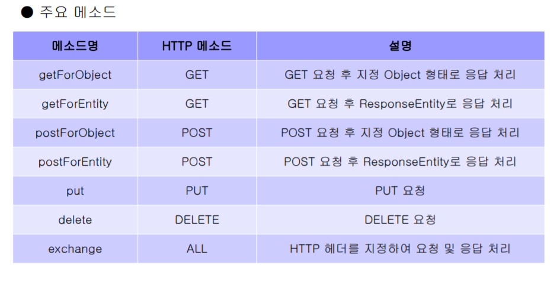


### STS(Spring Tool Suite)에서 import 하는법


1. General

   - Existing Project 

     >  프로젝트가 완성이 되어있는경우

2. Git

   - Projects from git 

     >  Github에서 clone할때(불완전)

3. Gradle

   - 프로젝트 파일이 불완전할때 파일을 보충하면서 import

<br><br>

### 카카오지도 API에서 위도 경도 정보 가져와서  브라우저 console에 출력

> controller1

```java
@GetMapping("/getKakao")
	public ResponseEntity<Map> getKakao(
			@RequestParam("address") String address) { //RequestParam으로 변수 받기
		RestTemplate rt = new RestTemplate();
		RequestEntity requestEntity = null;
		try {
			requestEntity = RequestEntity
					.get(new URI("https://dapi.kakao.com/v2/local/search/address.json?query="
							+ URLEncoder.encode(address, "utf-8")))
					.header("Authorization", "KakaoAK <인증키>").build();
		} catch (UnsupportedEncodingException e) {
			e.printStackTrace();
		} catch (URISyntaxException e) {
			e.printStackTrace();
		}
		ResponseEntity<Map> entity = rt.exchange(requestEntity, Map.class);
		return entity;
	}
```

> controller 2

```java
@Controller
public class serviceController {
	@GetMapping("/kakao")
	public String kakao() {
		return "kakao";
	}
```

> html

```html
<meta charset="UTF-8">
<input type="text" id="address">
<button>위도/경도 변환</button>
<hr>
<!--  자바스크립트(jQuery) AJAX활용 -->
<script src="http://code.jquery.com/jquery-3.1.1.min.js"></script>
<!--  getKakao 주소를 호출 -->
<!--  parsing 후 화면에 출력 -->
<script>
	$('button').click(function(){
		$.ajax({
			url : '/getKakao',
			type : 'get',
			data : {'address': $('#address').val()},
			success: function(res){
				console.log(res);
			}
		})
	});

</script>
```


<br>

### PAPAGO API를 이용해서 번역한 문장 json파일로 웹에서 보여주기

```java
@GetMapping("/getNaver")
	 public ResponseEntity<Map> getNaver(
			 @RequestParam("translate") String translate) {
	 RestTemplate rt = new RestTemplate();
	 RequestEntity<Map<String, String>> requestEntity = null;
	 try {
	 Map<String, String> body = new HashMap<>();
	 body.put("source", "ko");
	 body.put("target", "en");
	 body.put("text", translate);
	 requestEntity = RequestEntity.post(
	 new URI("https://openapi.naver.com/v1/papago/n2mt"))
	 .header("X-Naver-Client-Id", "<ID>")
	 .header("X-Naver-Client-Secret", "<SECRET_KEY>")
	 .body(body);
	 } catch (URISyntaxException e) {
	 e.printStackTrace();
	 }
	 ResponseEntity<Map> entity = rt.exchange(requestEntity, Map.class);
	 return entity;
}
```

> controller 2

```java
	@GetMapping("/papago")
	public String papago() {
		return "papago";
	}
```

> html

```html
<meta charset="UTF-8">
<input type="text" id="translate">
<button>번역 실행</button>
<hr>
<!--  자바스크립트(jQuery) AJAX활용 -->
<script src="http://code.jquery.com/jquery-3.1.1.min.js"></script>
<!--  getNaver 주소를 호출 -->
<!--  parsing 후 화면에 출력 -->
<script>
	$('button').click(function(){
		$.ajax({
			url : '/getNaver',
			type : 'get',
			data : {'translate': $('#translate').val()},
			success: function(res){
				console.log(res); //콘솔에 출력
				document.write(res.message.result.translatedText); //화면에 출력
			}
		})
	});

</script>
```

<br>

> html(번역한 문장 누적으로 계속 보여주기)

```java
<script>
	$('button').click(function(){
		$.ajax({
			url : '/getNaver',
			type : 'get',
			data : {'translate': $('#translate').val()},
			success: function(res){
				console.log(res); 
				var translatedText = res.message.result.translatedText;
				var html = '<h1>'+ translatedText + '</h1>'
				$('hr').after(html);
			}
		})
	});
</script>
```

> html(번역한 문장 누적으로 console에는 보여주지만 웹페이지에서는 최근 번역문장만 보여주기)

```java
<script>
	$('button').click(function(){
		$.ajax({
			url : '/getNaver',
			type : 'get',
			data : {'translate': $('#translate').val()},
			success: function(res){
				$('h1').empty();
				console.log(res);
				var translatedText = res.message.result.translatedText;
				var html = '<h1>'+ translatedText + '</h1>'
				$('hr').after(html);
				
			}
		})
	});

</script>
```


<br>

### find 단축키

- shift +ctrl +R