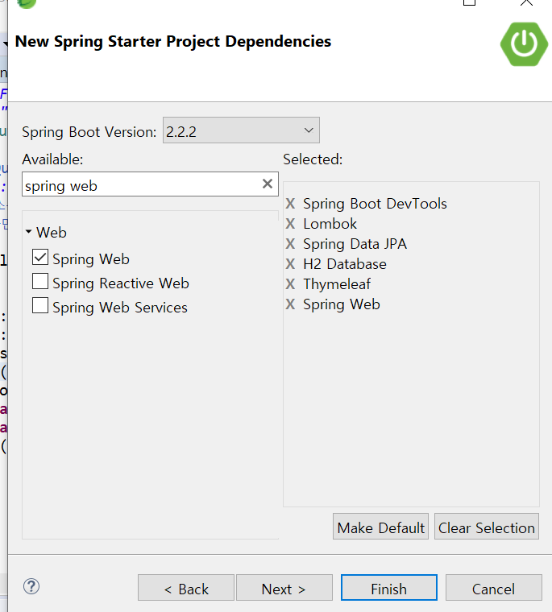

# 게시판 만들기

## 기능

- 회원가입, 로그인 - 게시판 ㆍ작성 / 조회(목록,상세내용) / 수정 / 삭제 

- 지도 ㆍ카카오 지도를 이용한 특정 위치를 기준으로 반경 10KM 이내 지점 표시 
- 이메일 발송 ㆍ구글 SMTP를 이용한 건의사항/의견 제출


## Start Project

> 다음 6개의 Project Dependencies를 꼭 넣어서 프로젝트를 만들자




## Main 페이지 만들기

- https://www.w3schools.com → Learn Bootstrap → B3 → BS Templates
- Portfolio 템플릿 다운로드

> controller

```java
@Controller
public class HomeController {
	@GetMapping({ "/", "/home" })
	public String index() {
		return "index";
	}
}
```


> templates/ index.html
>
> > head, nav, footer는 html사이트를 분리
> >
> > index(홈페이지 화면)코드에서는 th:replace로 삽입
> >
> > > th:replace : Thymeleaf를 이용하여 html코드를 가져와서 삽입.(파이썬의 데코레이터와 비슷한 역할)

```html
<head  th:replace="common/head"></head> //head.html불러오기


<body>

<nav th:replace="common/nav"></nav> //nav.html 불러오기

<div class="jumbotron">
  <div class="container text-center">
    <h1>My Portfolio</h1>      
    <p>Some text that represents "Me"...</p>
  </div>
</div>
  
<div class="container-fluid bg-3 text-center">    
  <h3>Some of my Work</h3><br>
  <div class="row">
    <div class="col-sm-3">
      <p>Some text..</p>
      
    </div>
    <div class="col-sm-3"> 
      <p>Some text..</p>
      
    </div>
    <div class="col-sm-3"> 
      <p>Some text..</p>
      
    </div>
    <div class="col-sm-3">
      <p>Some text..</p>
      
    </div>
  </div>
</div><br>

<div class="container-fluid bg-3 text-center">    
  <div class="row">
    <div class="col-sm-3">
      <p>Some text..</p>
      
    </div>
    <div class="col-sm-3"> 
      <p>Some text..</p>
      
    </div>
    <div class="col-sm-3"> 
      <p>Some text..</p>
      
    </div>
    <div class="col-sm-3">
      <p>Some text..</p>
      
    </div>
  </div>
</div><br><br>
 

<footer th:replace="common/footer"> //footer.html불러오기
 
</footer>

</body>
```


####  공통 레이아웃 분리

######   (index.html에서 th:replace로 불러오는 코드. 모든 페이지마다 공통으로 필요)

> head.html (홈페이지 head에 해당하는 부분)

```html
<head>
  <title>Bootstrap Example</title>
  <meta charset="utf-8">
  <meta name="viewport" content="width=device-width, initial-scale=1">
  <link rel="stylesheet" href="https://maxcdn.bootstrapcdn.com/bootstrap/3.4.1/css/bootstrap.min.css">
  <script src="https://ajax.googleapis.com/ajax/libs/jquery/3.4.1/jquery.min.js"></script>
  <script src="https://maxcdn.bootstrapcdn.com/bootstrap/3.4.1/js/bootstrap.min.js"></script>
  <style>
    /* Remove the navbar's default margin-bottom and rounded borders */ 
    .navbar {
      margin-bottom: 0;
      border-radius: 0;
    }
    
    /* Add a gray background color and some padding to the footer */
    footer {
      background-color: #f2f2f2;
      padding: 25px;
    }
  </style>
</head>
```


> nav.html (홈페이지 상단의 버튼)

---------------------------------------------------------

```html
<meta charset="utf-8">
<nav class="navbar navbar-inverse">
	<div class="container-fluid">
		<div class="navbar-header">
			<button type="button" class="navbar-toggle" data-toggle="collapse"
				data-target="#myNavbar">
				<span class="icon-bar"></span> <span class="icon-bar"></span> <span
					class="icon-bar"></span>
			</button>
			<a class="navbar-brand" href="#">Portfolio</a>
		</div>
		<div class="collapse navbar-collapse" id="myNavbar">
			<ul class="nav navbar-nav">
				<li class="active"><a href="#">Home</a></li>
				<li><a href="/board">Board</a></li>
				<li><a href="#">Gallery</a></li>
				<li><a href="#">Contact</a></li>
			</ul>

			<ul class="nav navbar-nav navbar-right">
				<li th:if="${session.user_info} == null"><a href="/signin">
						<span class="glyphicon glyphicon-log-in"></span> Sign in
				</a></li>
				<li th:if="${session.user_info} == null"><a href="/signup">
						<span class="glyphicon glyphicon-log-in"></span> Sign up
				</a></li>
				//Sign out버튼 + Sign in 한 상태에서는 "[이름]님 반갑습니다" 표시
				<li th:if="${session.user_info} != null"><a href="/signout">
						<span class="glyphicon glyphicon-log-out"></span> Sign out
						[[${session.user_info.name} + '님 반갑습니다.']]
				</a></li>

			</ul>
		</div>


	</div>
</nav>
```


> footer.html(홈페이지 하단)

```html
<footer class="container-fluid text-center">
  <p>Footer Text</p>
</footer>
```


## 회원가입 기능 만들기

- Sign up 버튼을 누르면 회원가입 페이지로 이동
- 사용자 정보 입력하면 H2 Database에 저장
- JPA
  - Model(@Entity)
  - ModelRepository(JpaRepository 상속)


> signup.html
>
> > index.html과 동일한 코드, 중간에 <div class="jumbotron">만 아래 코드로 대체
> >
> > script코드 삽입

```html
<div class="jumbotron">
 <div class="container text-center">
 <form method="post" action="/signup">
 <div class="form-group">
 <label for="email">Email:</label>
 <input type="text" class="form-control" id="email" name="email">
 </div>
 <div class="form-group">
 <label for="pwd">Password:</label>
 <input type="password" class="form-control" id="pwd" name="pwd">
 </div>
 <div class="form-group">
 <label for="name">Name:</label>
 <input type="text" class="form-control" id="name" name="name">
 </div>
 <button class="btn btn-primary btn-block" id="signup">Sign Up</button>
 </form>
 </div>
 </div>


<script>
 $("#signup").click(function() {
 $("form").submit();
 return false;
 });
 </script>

```


> H2 데이터베이스 활성화

- Embeded 모드로 데이터베이스 생성 -> Server모드로 데이터 베이스 생성


> application.properties
>
> >  JPA옵션
>
> > > update: 수정사항이 있을때만 수정
> > >
> > > create: 실행할때마다 새로 만듦

```java
# datasource
spring.datasource.url=jdbc:h2:tcp://localhost/~/board
spring.datasource.driverClassName=org.h2.Driver
spring.datasource.username=sa
spring.datasource.password=
# jpa
spring.jpa.hibernate.ddl-auto=update //*옵션
spring.jpa.database-platform=org.hibernate.dialect.H2Dialect
spring.jpa.show-sql=true
```

 

> model/User.java
>
> > 데이터 베이스 입력시 하나의 모델로서 테이블에 입력
> >
> > @Data :H2 데이터 베이스에 연결
> >
> > @Entity: getter, setter 없이 private 객체에 정보를 담을 수 있음

```java
@Entity
@Data
public class User {
@Id
@GeneratedValue(strategy = GenerationType.AUTO)
private long id;
private String email;
private String pwd;
private String name;
}
```

